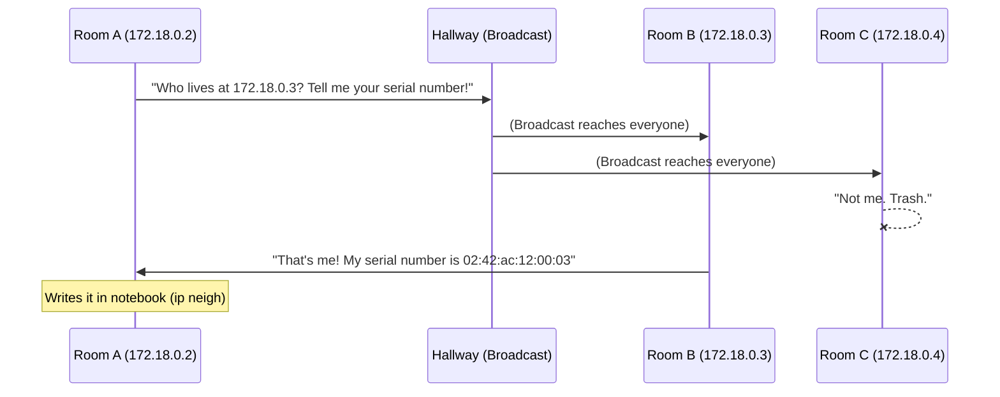
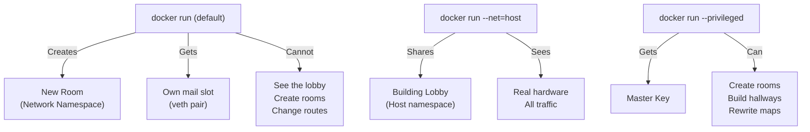

# The Pedagogy: The Complete Learning System

> This document is the single source of truth for how this course works.
> Any LLM or human author MUST follow these rules when writing module content.
> It covers: the teaching philosophy, the learning loop, file structure, tool introduction, navigation, sequencing, and fun.

---

## Part 0: The Lineage — Standing on the Shoulders of Legends

This course doesn't invent a teaching method. It steals the best ideas from the greatest educators across disciplines and fuses them into one coherent system for teaching networking. Every rule in this document traces back to a specific master.

### The Masters and What We Steal From Them

#### 1. Richard Feynman (Physics) — *"The Jargon Filter"*
**Core Insight:** The difference between knowing the name of something and knowing something. If you cannot explain it in simple words, you are hiding behind vocabulary.
**What we steal:**
- **The Name comes LAST.** We explain the physical reality using the postal metaphor. Only after the student understands the mechanism do we say: "Engineers call this TCP."
- **Multiple attack angles.** If an explanation doesn't land, we approach from a different direction — a different analogy, a different command, a different visualization. Never repeat the same failed explanation louder.
- **The Irreducible Core.** Strip every explanation to its essential mechanism. If a sentence doesn't help the student *predict* behavior, delete it.

#### 2. Socrates (Philosophy) — *"The Elenchus"*
**Core Insight:** The teacher's job is not to give answers. It is to ask questions that make the student realize their current understanding is incomplete, creating an irresistible pull toward deeper understanding.
**What we steal:**
- **The Prediction step.** Before every experiment, we force the student to commit to a guess. This is the Socratic thesis. The experiment then either confirms or refutes it.
- **"What makes you think that?"** When the student's prediction is wrong, we don't correct them. We ask: "Interesting — what led you to that prediction?" This forces them to examine their own mental model.
- **Productive discomfort.** The moment of "I was wrong" is not a failure. It is the most valuable moment in the entire module. We highlight it, celebrate it, and build on it.

#### 3. Grant Sanderson / 3Blue1Brown (Mathematics) — *"Visual Intuition First"*
**Core Insight:** Abstract concepts trapped in text are inaccessible. The same concepts rendered as animations and spatial diagrams become intuitive. Visuals are not decoration — they are pedagogy.
**What we steal:**
- **Mermaid diagrams in every module.** Packet flow, TCP handshakes, ARP broadcasts, NAT rewrites — all drawn as spatial, sequential diagrams using the postal metaphor labels.
- **Concrete before abstract.** We always show the `tcpdump` output, the `/proc` file, or the diagram BEFORE we generalize. Never start with the rule; start with the specific case.
- **The "re-discovery" arc.** We structure each module so the student feels like they are inventing the protocol themselves, not being told about it. "Given this limitation, what would YOU design?" The answer they arrive at is the protocol.

#### 4. Maria Montessori (Early Childhood Education) — *"The Prepared Environment & Auto-Correction"*
**Core Insight:** The teacher should prepare the environment so that the materials themselves give feedback. The child (student) should be able to discover errors without the teacher pointing them out.
**What we steal:**
- **The Docker lab IS the prepared environment.** Each module's `docker-compose.yml` creates a self-contained world where the student can explore freely without breaking their host machine. The environment is designed so that wrong actions produce visible, informative failures — not silent success.
- **Auto-correcting exercises.** When the student flushes the ARP cache and pings, `tcpdump` immediately shows the broadcast. When they write the wrong MAC, the packet vanishes. The system gives the feedback, not the teacher. The student doesn't need anyone to grade them.
- **Freedom within structure.** The Discovery Loop provides the structure. Within each step, the student is free to explore, try variations, and break things. The guardrails are in the lab design, not in the instructions.

#### 5. John Holt (Unschooling) — *"Remove the Fear"*
**Core Insight:** Children (and adults) stop learning when they are afraid of giving the wrong answer. The fear of failure causes them to play a "guessing game" of what the teacher wants, rather than genuinely exploring.
**What we steal:**
- **No grades, no tests, no scores.** The CHECKPOINT.md files are self-assessments. The student asks themselves: "Can I explain this?" There is no external judge.
- **The Prediction step is explicitly judgment-free.** We say: "There is no wrong answer here. The point is to see what your current mental model predicts." This removes the anxiety of guessing wrong.
- **"The Break" step normalizes destruction.** By giving the student explicit permission to break things, we remove the fear of touching the system. Engineers who are afraid to break things cannot debug them.

#### 6. Lev Vygotsky (Developmental Psychology) — *"The Zone of Proximal Development"*
**Core Insight:** Learning happens in the zone between "what I can do alone" and "what I can do with help." Tasks that are too easy produce boredom. Tasks that are too hard produce frustration. The sweet spot is "just beyond reach."
**What we steal:**
- **Scaffolding that fades.** Early modules (01-04) provide explicit, narrated commands: "Run this. Look for this word. It means this." Later modules (09-13) gradually remove the narration: "Use what you learned in Module 04 to figure out why this is happening." By Module 13, the student is investigating with minimal guidance.
- **Each module sits just beyond the previous one.** The causal chain guarantees this. Module 04 (ARP) is impossible without Module 03 (MAC). Module 06 (IP) is impossible without Module 05 (Subnets). The student is always stretching exactly one step beyond their current understanding.
- **The "Break It" step is the ZPD test.** If the student can predict the exact failure mode before they break it, they have internalized the mechanism. If they can't, they need to re-read the mechanism section.

#### 7. Robert Bjork (Cognitive Psychology) — *"Desirable Difficulties"*
**Core Insight:** Learning that feels easy is often shallow. Learning that feels effortful — retrieval practice, spacing, interleaving — produces dramatically better long-term retention. The struggle IS the learning.
**What we steal:**
- **Interleaving in the Checkpoints.** CHECKPOINT.md questions don't just test the current module. They mix in questions from previous modules: "In Module 02, we learned that sockets are file descriptors. How does that relate to what you just learned about ports?" This forces cross-module retrieval.
- **Spaced retrieval through the causal chain.** Every module explicitly references previous modules: "Remember in Module 04 when we shouted for a MAC address? That shout is being blocked by the wall we just built." This forces the student to retrieve old knowledge in a new context.
- **The Prediction step IS retrieval practice.** Forcing the student to predict before experimenting requires them to actively retrieve their mental model and apply it, rather than passively reading.

#### 8. Randal Bryant & David O'Hallaron / CS:APP (Computer Systems) — *"The Programmer's Perspective & Lab-Driven Learning"*
**Core Insight:** The only way to truly learn systems is to DO systems. Reading about memory hierarchies doesn't work. Writing a 20-line C program that exposes the cache behavior works. Labs with automatic feedback are the core of the course, not supplements to it.
**What we steal:**
- **The C programs and Python scripts.** The student doesn't just run `nc`. They write a 15-line C program that calls `socket()`, `bind()`, `listen()`. They compile it. They run it. They trace it with `strace`. They OWN the mechanism.
- **The "Programmer's Perspective."** We don't teach networking from the network engineer's perspective (configuring Cisco routers). We teach it from the programmer's perspective: "What happens when your code calls `connect()`? What system calls fire? What kernel data structures change?"
- **Auto-evaluated labs.** The Docker environment provides instant feedback. The student doesn't submit work to a grader. They run `tcpdump` and either see the expected output or they don't. The system is the grader.

---

### How the Masters Map to the Discovery Loop

```
  Step              │ Primary Master           │ What They Taught Us
  ──────────────────┼──────────────────────────┼─────────────────────────────────
  1. THE BURN       │ Montessori               │ The environment presents the problem.
  2. THE PREDICTION │ Socrates + Bjork + Holt  │ Force retrieval, normalize being wrong.
  3. THE EXPERIMENT │ CS:APP + Montessori      │ Lab-driven. Auto-correcting. The student does.
  4. THE GAP        │ Socrates + Vygotsky      │ Productive discomfort in the ZPD.
  5. THE MECHANISM  │ Feynman + 3Blue1Brown    │ Simple words + visual diagrams. Name LAST.
  6. THE VERIFY     │ CS:APP + Feynman         │ Read the kernel's handwriting. Multiple angles.
  7. THE BREAK      │ Holt + Montessori        │ Fearless destruction. The system gives feedback.
  8. THE NEXT BURN  │ Vygotsky + Bjork         │ Stretch one step beyond. Interleave old concepts.
```

---

## Part 1: The Discovery Loop

**The student is not a vessel to be filled. The student is an investigator following a trail of evidence.**

We never preach. We never say "here is how X works." 
We create a situation where the student *needs* to understand X to solve a problem they are physically staring at in their terminal. Understanding is pulled by curiosity, not pushed by authority.

Every concept is taught through one complete cycle of this loop:

```
  1. THE BURN         → Something doesn't work, or something surprising happens.
                        [Montessori: the prepared environment surfaces the problem]

  2. THE PREDICTION   → "What do you think is going on?" Force a guess.
                        [Socrates: the thesis. Bjork: retrieval practice. Holt: no wrong answers]

  3. THE EXPERIMENT   → Run the command. See what actually happens.
                        [CS:APP: lab-driven. Montessori: auto-correcting materials]

  4. THE GAP          → Prediction vs reality. Highlight the surprise.
                        [Socrates: the elenchus. Vygotsky: productive struggle in the ZPD]

  5. THE MECHANISM    → NOW explain. Postal metaphor first, jargon name LAST.
                        [Feynman: irreducible core. 3B1B: concrete before abstract, with diagrams]

  6. THE VERIFICATION → Prove it by reading the kernel's own evidence.
                        [CS:APP: the programmer's perspective. Feynman: multiple attack angles]

  7. THE BREAK        → Deliberately destroy the mechanism. Watch the failure.
                        [Holt: fearless exploration. Montessori: the system gives feedback]

  8. THE NEXT BURN    → The limitation of this mechanism creates the next problem.
                        [Vygotsky: stretch one step beyond. Bjork: interleave with previous modules]
```

---

## Part 2: Repository File Structure

### Top Level
```
networking_crash_course/
│
├── README.md                  ← The front door. Progress map. "You Are Here."
├── PEDAGOGY.md                ← This file. The teaching system.
├── TOOLBOX.md                 ← Master reference card for ALL tools (alphabetical).
│
├── act-1--two-programs-talking/
│   ├── 01-the-tray/
│   └── 02-the-fake-tray/
│
├── act-2--the-crowded-hallway/
│   ├── 03-the-serial-number/
│   └── 04-the-shout/
│
├── act-3--escaping-the-building/
│   ├── 05-the-walls/
│   ├── 06-the-room-number/
│   ├── 07-the-map/
│   └── 08-the-gossip/
│
├── act-4--the-conversation/
│   ├── 09-the-desk-number/
│   ├── 10-the-registered-mail/
│   └── 11-the-paper-airplane/
│
└── act-5--making-it-human/
    ├── 12-the-phonebook/
    └── 13-the-con-artist/
```

### Why Acts are Directories
The student should open the repo and immediately see a **story with chapters**, not a flat list of 13 cryptic folders. The Act directories group related questions into narrative arcs. A student who finishes Act II can say: "I understand how computers talk in a crowded room." That's a meaningful milestone, not just "I finished Module 4."

### Inside Each Module Folder
```
01-the-tray/
│
├── README.md              ← The investigation. The main content.
├── lab/
│   ├── docker-compose.yml ← The lab environment. One command to start.
│   └── Dockerfile         ← Custom image (when baking in C/Python programs).
├── code/
│   ├── tray.c             ← A tiny C program the student compiles and runs.
│   └── inspect.py         ← A Python script that visualizes kernel state.
├── diagrams/
│   └── flow.md            ← Mermaid diagrams embedded in markdown.
├── TOOLS.md               ← Reference card for ONLY the tools used in THIS module.
└── CHECKPOINT.md          ← 3-5 self-test questions.
```

**Why this split?**

| File / Dir         | Purpose                                                    | When the student reads it            |
|--------------------|------------------------------------------------------------|--------------------------------------|
| `README.md`        | The narrative investigation. Follows the Discovery Loop.   | During the module. This IS the lesson. |
| `lab/`             | Docker environment + optional custom Dockerfile.           | Before starting. One command setup.  |
| `code/`            | C and Python source files the student compiles/runs.       | During the investigation. They build and run these. |
| `diagrams/`        | Mermaid diagrams showing packet flow, state machines, etc. | Embedded in README. Visual anchors. |
| `TOOLS.md`         | Quick-reference for the tools introduced in THIS module.   | During or after. "Wait, what flag was that?" |
| `CHECKPOINT.md`    | Self-assessment. Feynman questions.                        | After finishing. "Do I actually get it?" |

---

## Part 3: How to Structure README.md (The Investigation)

Every module's README.md follows this exact skeleton. Sections must appear in this order.

```markdown
# [Act Name] · [Question as Title]

> **You are here:** Act X of V · Question Y of 13
> **Time:** ~20-30 minutes
> **Tools you'll meet:** `tool_a`, `tool_b`
> **Prerequisites:** [Link to previous module]

---

## The Situation
[2-4 paragraphs. Set the scene. Describe what the student 
is about to try. Use the postal metaphor. End with the 
thing that doesn't work or surprises them.]

## Your Prediction
[A boxed prompt. Literally ask them to pause and think.
"Before you run anything: what do you think will happen 
when you type X? Write it down or say it out loud."]

## The Lab
[Step-by-step setup. Maximum 3 commands to get the 
environment running. Must be copy-pasteable.]

## The Investigation
[This is the longest section. Broken into numbered steps.
Each step has THREE parts:]

### Step N: [Action in plain English]

**Run this:**
```bash
[the command]
```

**What to look for:**
[Exactly which line, word, hex value, or flag to find 
in the output. Describe what it looks like.]

**What it means:**
[Connect the evidence to the postal metaphor. 
Then give the jargon name in parentheses.]

## The Evidence
[One definitive piece of proof from /proc, /sys, strace, 
or tcpdump. The kernel's own handwriting.]

## 💡 The Moment
[The holy shit realization. 2-3 sentences maximum.
This should shift the student's mental model.]

## Break It
[A deliberate sabotage exercise. The student destroys 
the mechanism and watches the predictable failure. 
This proves they understand it, not just memorized it.]

## What You Can Do Now
[A plain-English summary of the new power the student has.
"You can now send data between two programs on separate 
machines by writing to a fake file descriptor."]

## The New Problem
[2-3 sentences. The limitation that creates the burning 
question for the next module. End with a link.]

**[Next: Question Y+1 →](link)**
```

---

## Part 4: Tool Introduction Rules

### Rule 1: Tools Are Earned
Never introduce a tool before the student needs it. The student must feel the question first.

Bad: "In this module, we will use `tcpdump`, `ip neigh`, and `strace`."
Good: "Something invisible happened during that ping delay. We need a way to see what's on the wire."

### Rule 2: One Tool At a Time
Never introduce more than ONE new tool per investigation step. If the step requires two tools, split it into two steps.

### Rule 3: Introduce In the README, Reference in TOOLS.md
The first time a tool appears, the README explains it conversationally in 1-2 sentences at the point of use. The module's `TOOLS.md` provides the concise reference card (flags, common usage) for later lookup.

### Rule 4: The TOOLS.md Format
```markdown
# Tools: Module 01

## strace
**What it answers:** "What system calls is this program making right now?"
**How we used it:** To watch `cat` block on the `read()` syscall.
**Quick reference:**
| Command | What it does |
|---------|-------------|
| `strace -e openat,read <cmd>` | Trace only file open and read calls |
| `strace -e write <cmd>` | Trace only write calls |
| `strace -p <PID>` | Attach to an already-running process |

## mkfifo
**What it answers:** "How do I create a shared memory tray between two programs?"
**How we used it:** To create a named pipe that two terminals can read/write.
**Quick reference:**
| Command | What it does |
|---------|-------------|
| `mkfifo <name>` | Create a named pipe |
| `ls -l <name>` | Verify it (look for the `p` flag) |
```

### Rule 5: The Master TOOLBOX.md
The root-level `TOOLBOX.md` is an alphabetical master reference of ALL tools across ALL modules. Each entry links back to the module where the tool was first introduced. The student never has to search for "where did I learn about `tcpdump`?"

---

## Part 5: Sequencing & Navigation (Never Getting Lost)

### The Progress Map (Root README.md)
The root README.md contains a visual progress map. It should feel like a video game world map, not a table of contents.

```markdown
## Your Journey

### Act I: Two Programs Talking
- [ ] 01 · The Tray — "How do they share a note?"
- [ ] 02 · The Fake Tray — "What if they're in different buildings?"

### Act II: The Crowded Hallway  
- [ ] 03 · The Serial Number — "How do we ignore the noise?"
- [ ] 04 · The Shout — "How do we find the hardware ID?"

[... etc ...]
```

The student checks off modules as they complete them. This provides a sense of progress and makes the remaining journey visible.

### The "You Are Here" Header
Every module README starts with a location header:
```
> **You are here:** Act II · Question 4 of 13
```
This prevents the student from ever feeling lost inside the repo.

### The Breadcrumb Links
Every module has navigation links at the top and bottom:
```
**[← Previous: Q3 The Serial Number](../03-the-serial-number/)** · **[Next: Q5 The Walls →](../../act-3--escaping-the-building/05-the-walls/)**
```

### The "What You Can Do Now" Summary
Every module ends with a plain-English statement of what the student gained. This serves as both a reward and a sanity check:
```
## What You Can Do Now
You can create isolated network rooms and connect them with virtual cables.
You can prove that broadcast traffic is trapped inside a room.
```

---

## Part 6: Making It Fun

### Pacing
- Module 01 must be completable in **10 minutes** and feel like a revelation. Quick wins build momentum.
- No module should exceed **30 minutes**. If it does, split it.
- Every 3 modules, the student should feel a major milestone ("I just built a router by hand").

### Tone
- Write like a slightly mischievous senior engineer sitting next to the student. Not a professor. Not a textbook.
- Use "you" and "we." Never use passive voice ("it can be observed that...").
- Curse words are fine in moderation if they capture genuine surprise ("Holy shit, the OS has been lying to you this whole time").

### The 💡 Moments
Every module has exactly one 💡 moment. This is the emotional peak — the instant the student's mental model shifts. It should feel like a plot twist, not a summary. Examples:
- "The program literally cannot tell the difference between writing to a file and writing to a computer in Tokyo."
- "Every time you've ever pinged a new machine, your OS was screaming into the hallway and you never knew."

### The Break-It Exercises
Breaking things is inherently fun. The student gets to be destructive with permission. These exercises also serve as the deepest form of verification: if you can predict exactly how something will fail, you truly understand it.

### Easter Eggs (Optional)
Modules can include brief, fascinating real-world stories:
- Module 08 (BGP): The 2008 Pakistan/YouTube hijack.
- Module 13 (NAT): The IPv4 exhaustion panic and why IPv6 adoption is still glacial.
- Module 04 (ARP): ARP spoofing attacks and how hackers use the "shout" mechanism maliciously.

These are sprinkled, not forced. 1-2 sentences max. They make the student feel like they're learning something dangerous and powerful, not just academic.

---

## Part 7: The Metaphor Integrity Rules

The entire course uses ONE metaphor: **The Postal System in a Growing Building.**

| Real Concept       | Metaphor                              |
|--------------------|---------------------------------------|
| Process            | A person sitting at a desk            |
| RAM / Memory       | A shared tray on the table            |
| Network wire       | A hallway connecting rooms            |
| Network card (NIC) | A mail slot in the door               |
| Packet             | A letter                              |
| MAC address        | Serial number on the mail slot        |
| IP address         | Room number in the building           |
| Subnet             | A floor in the building               |
| Router             | Mail clerk at the stairwell           |
| Port               | Desk number inside the room           |
| TCP                | Registered mail with confirmation     |
| UDP                | Paper airplane down the hallway       |
| DNS                | Chain of phonebooks                   |
| NAT                | Mail clerk rewriting return addresses |
| Broadcast          | Shouting in the hallway               |
| ARP                | Shouting "Who lives at Room X?"       |
| Default Gateway    | The building's front door             |

This metaphor must never be broken or mixed with other metaphors. It must be extended, never replaced.

---

## Part 8: Code Artifacts (C Programs & Python Scripts)

### Why Code?
Running `nc` and `tcpdump` teaches you to *observe* the mechanism. Writing a 15-line C program that calls `socket()`, `bind()`, `listen()`, `accept()` teaches you to *build* the mechanism. The student should do both.

### The Progression of Code
Code artifacts follow their own causal chain across the course:

| Module | C Program | What It Proves |
|--------|-----------|----------------|
| 01 (The Tray) | `tray.c` — Opens a FIFO with `open()`, writes with `write()`, reads with `read()`. | The student *becomes* the kernel. They see that IPC is just three system calls. |
| 02 (The Fake Tray) | `socket_hello.c` — Calls `socket()`, `connect()`, `write()`. A 20-line TCP client. | The student sees that the socket API is nearly identical to the file API from Module 01. The lie is revealed in code. |
| 02 (The Fake Tray) | `socket_listen.c` — Calls `socket()`, `bind()`, `listen()`, `accept()`. A 25-line TCP server. | The student runs their own server and connects to it with `nc`. They wrote both sides. |
| 09 (Desk Number) | `multi_listen.c` — Binds two sockets to two ports in the same program. | The student sees that ports are just integers passed to `bind()`. |
| 10 (Registered Mail) | `seq_numbers.py` — Parses a `tcpdump` capture file and prints a timeline of sequence numbers and ACKs. | Transforms raw hex into a human-readable conversation. |
| 13 (Con Artist) | `nat_inspect.py` — Reads `/proc/net/nf_conntrack` and prints a formatted table of original → rewritten addresses. | The student sees the con artist's notepad in a clean table instead of raw kernel gibberish. |

### Rules for Code Artifacts
1. **Maximum 30 lines.** If it's longer, the student will skip it. Every line must earn its place.
2. **No frameworks, no libraries.** Raw POSIX C. Raw Python `socket` module. The student must see the system calls naked.
3. **Compile and run inside the container.** The `lab/Dockerfile` must include `gcc` (for C) and `python3` (for Python). The code is volume-mounted or baked into the image.
4. **The README walks through every line.** The code is not homework. It is narrated: "Line 7 calls `bind()`. This is the moment the kernel reserves desk number 4444 for our program."

### The Dockerfile Pattern
When a module needs custom C programs baked into the image:
```dockerfile
FROM nicolaka/netshoot
RUN apk add --no-cache gcc musl-dev python3
COPY code/ /lab/code/
WORKDIR /lab/code
```
The `docker-compose.yml` references this Dockerfile:
```yaml
services:
  workbench:
    build: .
    stdin_open: true
    tty: true
```

---

## Part 9: Visual Aids (Mermaid Diagrams)

### Why Diagrams?
Networking is inherently spatial. Packets travel through layers, across rooms, and between machines. A wall of text cannot convey this. Every module MUST include at least one Mermaid diagram embedded in the README.

### Diagram Types by Module

| Module | Diagram Type | What It Shows |
|--------|-------------|---------------|
| 01 | Flowchart | Program A → Kernel RAM Tray → Program B |
| 02 | Flowchart | Program A → FD 3 → Kernel → NIC → Wire → NIC → Kernel → FD 4 → Program B |
| 03 | Sequence | Frame with SRC MAC and DST MAC wrapping the payload. NIC checks, accepts or drops. |
| 04 | Sequence | ARP Request (broadcast) → ARP Reply (unicast) → Cached in neighbor table |
| 05 | Flowchart | Two namespaces (rooms) connected by veth pair, router blocking broadcasts |
| 06 | Flowchart | IP split into Network (floor) + Host (desk) via subnet mask AND operation |
| 07 | Flowchart | Packet hopping through 3 routers, each consulting their routing table |
| 08 | Flowchart | BGP gossip: AS1 ↔ AS2 ↔ AS3 advertising reachable prefixes |
| 09 | Flowchart | Incoming packet → kernel reads port → dispatches to correct process FD |
| 10 | Sequence | Full TCP handshake: SYN → SYN-ACK → ACK → Data → ACK → FIN |
| 11 | Sequence | UDP: Data → (nothing). Side-by-side comparison with TCP sequence from Q10. |
| 12 | Flowchart | DNS recursive resolution chain: Stub → Recursive → Root → TLD → Authoritative |
| 13 | Flowchart | NAT rewrite: Internal IP → Router crosses out, writes public IP → Internet → Reply → Router restores |

### Mermaid Embedding Rules
1. Diagrams are embedded directly in the README.md using fenced ` ```mermaid ` blocks.
2. A standalone `diagrams/flow.md` file in each module contains the same diagram for reference and for rendering in tools that don't support inline mermaid.
3. Diagrams use the postal metaphor labels, not jargon. Label nodes as "Room A" not "Namespace A" (the first time).
4. Keep diagrams to a maximum of 10-12 nodes. If larger, split into multiple diagrams.

### Example (Module 04: The Shout)


---

## Part 10: Docker Modes (--privileged, --net=host, and Why They Matter)

### Why This Matters
The student will be running Docker commands throughout the course. Two flags — `--privileged` and `--net=host` — are not just convenience options. They directly map to the isolation mechanisms we are teaching. They MUST be explained as part of the learning, not glossed over as setup boilerplate.

### When Each Mode Is Used

| Docker Mode | What It Does (Postal Metaphor) | When We Use It |
|-------------|-------------------------------|----------------|
| Default (`docker run`) | Creates a new room (network namespace) with its own mail slot (veth). The room is fully isolated. | Modules 01-04, 09-12. Standard isolation. |
| `--net=host` | **No new room.** The program sits in the building's lobby and uses the building's own mail slot. It can see ALL hallway traffic. | Module 03 (inspecting real hardware with `ethtool`), Module 07 (reading the host's routing table). |
| `--privileged` | The program gets the building manager's master key. It can create/destroy rooms, build hallways, change mail slot serial numbers, and modify the routing map. | Modules 05-08 (creating namespaces, veths, routes), Module 13 (writing NAT rules with iptables). |
| `--cap-add=NET_ADMIN` | A lighter version of `--privileged`. The program can modify network config but can't access hardware or create namespaces. | When we need `tc` (traffic control) in Module 10. |

### How to Teach This
Do NOT explain all four modes upfront. Introduce each mode at the exact moment the student hits a permission error:

- **Module 01-02:** Default mode. No explanation needed. It just works.
- **Module 03:** The student tries `ethtool eth0` inside a default container. It works but shows virtual hardware. We explain: "You're in an isolated room. To see the real building's hardware, you need to sit in the lobby." We add `--net=host`.
- **Module 05:** The student tries `ip netns add`. It fails with `Operation not permitted`. We explain: "You're a tenant, not the building manager. To build new rooms, you need the master key." We add `--privileged`.
- **Module 10:** The student tries `tc qdisc add`. It fails. We explain: "You don't need the full master key. You just need the network admin badge." We add `--cap-add=NET_ADMIN`.

This way, each Docker mode is discovered through a permission failure, explained through the postal metaphor, and never feels like arbitrary boilerplate.

### The Docker Modes Diagram (Root README or Module 05)


---

## Part 11: The Metaphor Integrity Rules

The entire course uses ONE metaphor: **The Postal System in a Growing Building.**

| Real Concept       | Metaphor                              |
|--------------------|---------------------------------------|
| Process            | A person sitting at a desk            |
| RAM / Memory       | A shared tray on the table            |
| Network wire       | A hallway connecting rooms            |
| Network card (NIC) | A mail slot in the door               |
| Packet             | A letter                              |
| MAC address        | Serial number on the mail slot        |
| IP address         | Room number in the building           |
| Subnet             | A floor in the building               |
| Router             | Mail clerk at the stairwell           |
| Port               | Desk number inside the room           |
| TCP                | Registered mail with confirmation     |
| UDP                | Paper airplane down the hallway       |
| DNS                | Chain of phonebooks                   |
| NAT                | Mail clerk rewriting return addresses |
| Broadcast          | Shouting in the hallway               |
| ARP                | Shouting "Who lives at Room X?"       |
| Default Gateway    | The building's front door             |
| `--privileged`     | The building manager's master key     |
| `--net=host`       | Sitting in the building's lobby       |
| Network Namespace  | A soundproof room                     |
| veth pair          | A hallway between two rooms           |

This metaphor must never be broken or mixed with other metaphors. It must be extended, never replaced.
