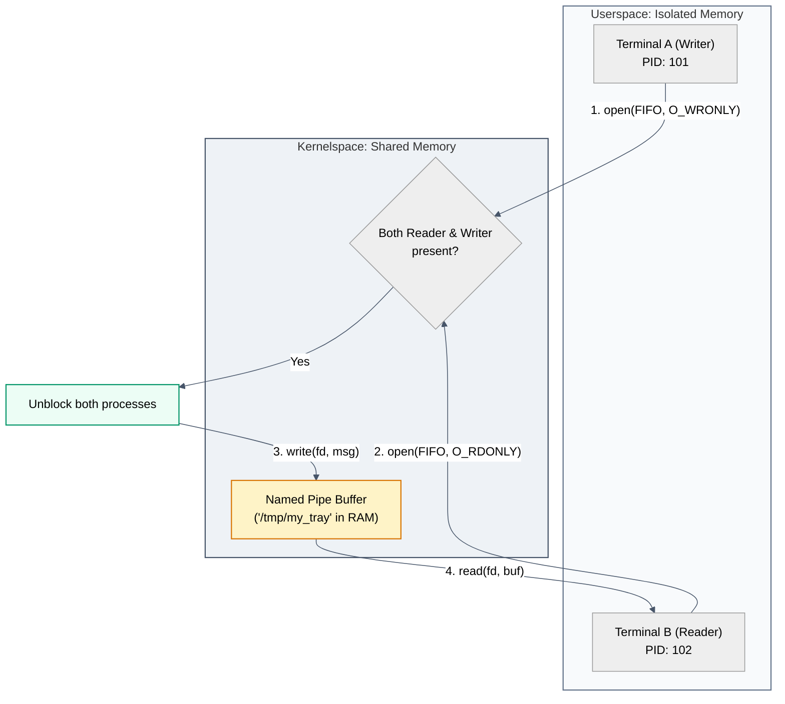

# Act I: Two Programs Talking · How do they share a note?

> **You are here:** Act I · Question 1 of 13
> **Time:** ~15 minutes
> **Tools you'll meet:** `mkfifo` (The Shared Tray), `strace` (The Diagnostic Eye), `ls -l`
> **Prerequisites:** None

---

> [!NOTE]
> **🗺️ The Seeker's Path: How to Study This Module**
> To master this module's concept, follow these steps in order:
> 1. **Predict:** Read **Your Prediction** and guess what will happen.
> 2. **Setup:** Go to **The Lab** and spin up your terminals.
> 3. **Inspect the Code:** Open [tray.c](file:///Users/rahullohia/repos/networking_crash_course_for_kubernetes/act-1--two-programs-talking/01-the-tray/code/tray.c) to inspect the system calls.
> 4. **Run the Lab:** Compile and run the code in **The Investigation** steps.
> 5. **Visualise the Flow:** Study the embedded **Mermaid Diagram** under **Visualise the Flow** to see how the processes are matched in memory.
> 6. **Break It:** Sabotage the pipe to see how the OS keeps the memory buffer alive.

---

## The Situation

We begin with the illusion of separateness. 

Imagine you are sitting inside a computer. You have opened two separate terminal windows. In the world of operating systems, each window is a process, running in its own isolated memory space. The kernel has built a wall between them, promising that Process A cannot touch, see, or corrupt the memory of Process B. They are like two monks meditating in separate, soundproof rooms.

You want to pass a simple message from Room A to Room B. 

But here is the catch:
- You **cannot** use the network (no sockets exist yet).
- You **cannot** write the message to a file on the disk (imagine the hard drive is read-only).

How do two separate minds share a single thought when the world is partitioned? 

We must find a way to create a shared space in memory—a temporary "tray" on the table that both monks can reach.

---

## Your Prediction

> [!IMPORTANT]
> **Before running any commands, pause and reflect:**
> If you build a channel in memory, and the writer process tries to drop a message into it before the reader process is even listening, what will happen? Will the writer be forced to wait, standing there with its arm outstretched, or will the message simply vanish into the void?

---

## The Lab

Let's build our meditation chambers. Open your terminal, navigate to this directory, and start the environment:

```bash
cd act-1--two-programs-talking/01-the-tray/lab
docker compose up -d
docker compose exec workbench bash
```

Now, **open a second terminal window** and enter the same container to represent the second room:

```bash
docker exec -it tray_workbench bash
```

You now have two windows looking into the same container.

---

## The Investigation

We will use a Linux primitive called a **Named Pipe** (or FIFO). In our metaphor, this is a shared tray in RAM.

### Step 1: Create the Shared Tray

In Terminal 1, create a named pipe at `/tmp/my_tray`:

**Run this:**
```bash
mkfifo /tmp/my_tray
```

Now, inspect this new object:
```bash
ls -l /tmp/my_tray
```

**What to look for:**
Look at the very first character of the output:
```text
prw-r--r-- 1 root root 0 Jun 21 21:00 /tmp/my_tray
```
It starts with a `p` (for pipe). And its size is `0` bytes.

**What it means:**
This file has no physical existence on the hard drive. It is a ghost. The path `/tmp/my_tray` is simply a name—a hook in the filesystem that points directly to a buffer in the kernel's RAM. It is a tray that exists only as long as we look at it.

---

### Step 2: The Blocked Reader

In Terminal 2, let's try to read from the tray:

**Run this:**
```bash
cat /tmp/my_tray
```

**What to look for:**
The cursor blinks. The terminal freezes. It does not return.

**What it means:**
The reader is waiting. The kernel has put the `cat` process to sleep. Why? Because you cannot take something from a tray until someone puts it there. The `open()` system call blocks, waiting for a partner.

---

### Step 3: The Writer Unblocks the Flow

In Terminal 1, write a message to the tray:

**Run this:**
```bash
echo "Hello from the other side!" > /tmp/my_tray
```

**What to look for:**
The moment you press Enter, both terminals release! Terminal 1 returns to its prompt, and Terminal 2 prints:
```text
Hello from the other side!
```

---

### Step 4: Tracing the System Calls

Let's see what is actually happening in the kernel's own handwriting. We will compile our custom C program `tray.c` and watch the system calls.

> [!TIP]
> **🔍 Step 4a: Inspect the Code First**
> Before compiling, open and inspect the source code in [tray.c](file:///Users/rahullohia/repos/networking_crash_course_for_kubernetes/act-1--two-programs-talking/01-the-tray/code/tray.c). Look at how standard `open()`, `read()`, and `write()` calls are used to communicate between processes, and note how the `open()` call blocks until both processes are present.

In Terminal 2, compile the program:
```bash
gcc -o /lab/code/tray /lab/code/tray.c
```

Now, run the reader program wrapped in `strace` to watch the system calls:
```bash
strace -e openat,read /lab/code/tray read
```

**What to look for:**
The output shows the program stopping at:
```text
openat(AT_FDCWD, "/tmp/my_tray", O_RDONLY) = ... <waiting...>
```
It is suspended inside the `open` system call.

Now, in Terminal 1, run the writer:
```bash
/lab/code/tray write "Zen Syscall Message"
```

Instantly, the `strace` in Terminal 2 wakes up and prints:
```text
openat(AT_FDCWD, "/tmp/my_tray", O_RDONLY) = 3
read(3, "Zen Syscall Message\0", 128)      = 21
Received message: 'Zen Syscall Message'
+++ exited with 0 +++
```

**What it means:**
1. The kernel blocked the reader inside `openat()`.
2. When the writer called `openat()`, the kernel matched them together and unblocked both.
3. The reader read from file descriptor `3`. The bytes were copied directly in RAM from one process to the other.

---

## 🗺️ Visualise the Flow

Now that you've run the code and traced the system calls, look at the diagram below (also available as a standalone reference in [flow.md](file:///Users/rahullohia/repos/networking_crash_course_for_kubernetes/act-1--two-programs-talking/01-the-tray/diagrams/flow.md)) to visualize how the kernel matches the reader and writer processes in memory:



---

## The Evidence

The proof that the OS treats this network-like communication as a file is in the process directory. While the reader is running in the background:

```bash
/lab/code/tray read > /dev/null &
PID=$!
ls -l /proc/$PID/fd/
```
You will see:
```text
lr-x------ 1 root root 64 Jun 21 21:00 3 -> /tmp/my_tray
```

The process is simply reading from "File Descriptor 3." It doesn't know it's a pipe.

---

## 💡 The Moment

> [!TIP]
> **The Holy realization:**
> Everything in UNIX — even communicating between separate minds — is treated as a file. When your program writes to file descriptor `3`, it does not care if the bytes are going to a magnetic disk, a screen, or a buffer in RAM owned by another process. The interface is identical. Separation is an illusion maintained by the filesystem mask.

---

## Break It

What happens if you delete the named pipe while a process is waiting on it?

1. In Terminal 2, start the reader:
   ```bash
   cat /tmp/my_tray
   ```
2. In Terminal 1, delete the pipe:
   ```bash
   rm /tmp/my_tray
   ```
3. Look at Terminal 2. It is still waiting! Why?
4. Recreate the pipe and send a message:
   ```bash
   mkfifo /tmp/my_tray
   echo "Can you hear me?" > /tmp/my_tray
   ```
   Terminal 2 doesn't receive it. Why? Because Terminal 2 opened the *original* memory object. Deleting the file path from `/tmp` only unlinked the name. The kernel keeps the actual RAM buffer alive until Terminal 2 closes its file descriptor.

---

## What You Can Do Now

- You can pass bytes between isolated processes on the same machine without using a disk.
- You can explain how `open()`, `read()`, and `write()` syscalls block to synchronize processes.

---

## The New Problem

Named pipes are beautiful, but they rely on a shared filesystem. `/tmp/my_tray` is a path on a local disk index.

What if Terminal B is running on a **completely different computer** across the room? They do not share `/tmp`. The shared tray is gone. How do we pass a note now?

We need a fake tray—a file descriptor that secretly writes bytes over the wire.

**[Next: Act I, Question 2 → The Fake Tray](../02-the-fake-tray/)**
