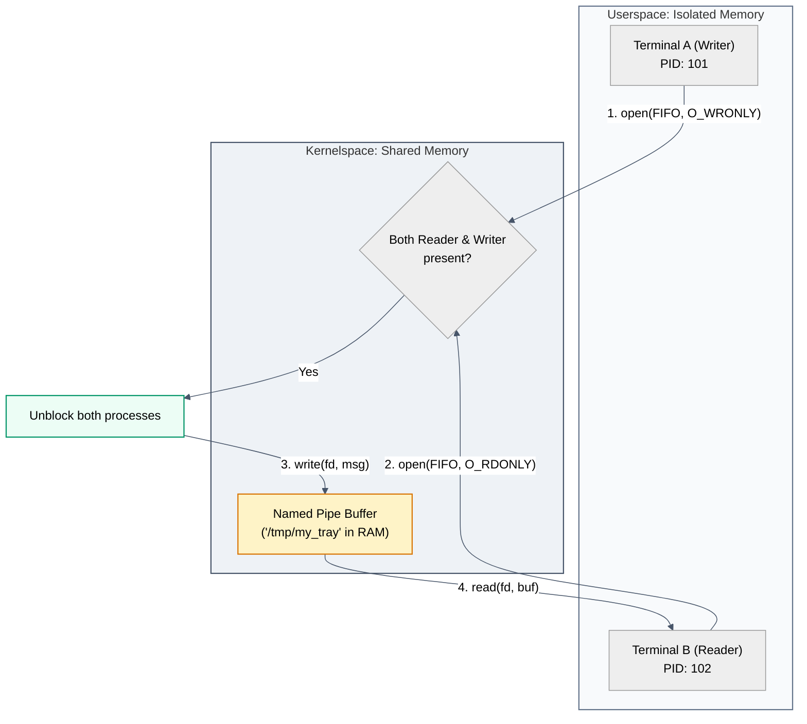

# Diagram: Named Pipe Flow (Module 01)

This diagram shows how the OS kernel manages memory (the "tray") to pass bytes between two isolated processes on the same machine without touching the disk.

