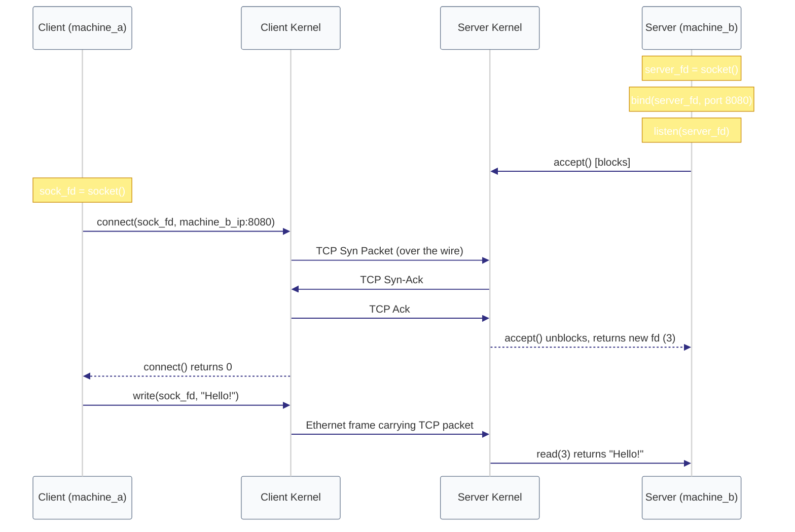

# Diagram: Socket Connection Flow (Module 02)

This diagram shows how the OS kernel translates standard read/write file system calls into network packets, keeping the network card (NIC) and wires hidden behind a File Descriptor "mask."

