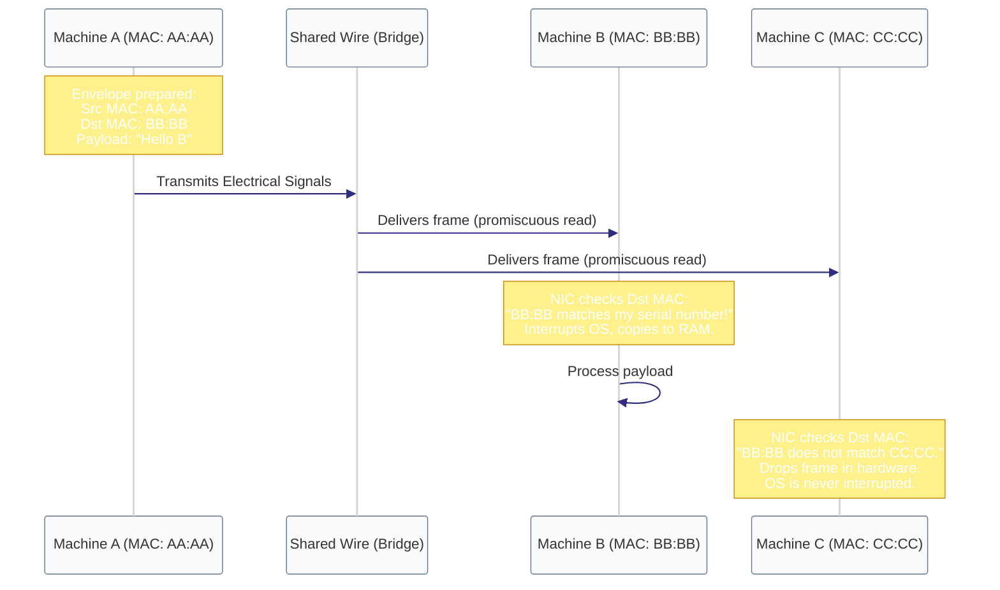

# Diagram: Ethernet Frame Filtering (Module 03)

This diagram shows how three machines sharing a virtual wire receive all data, but only the machine matching the Destination MAC address processes it.

