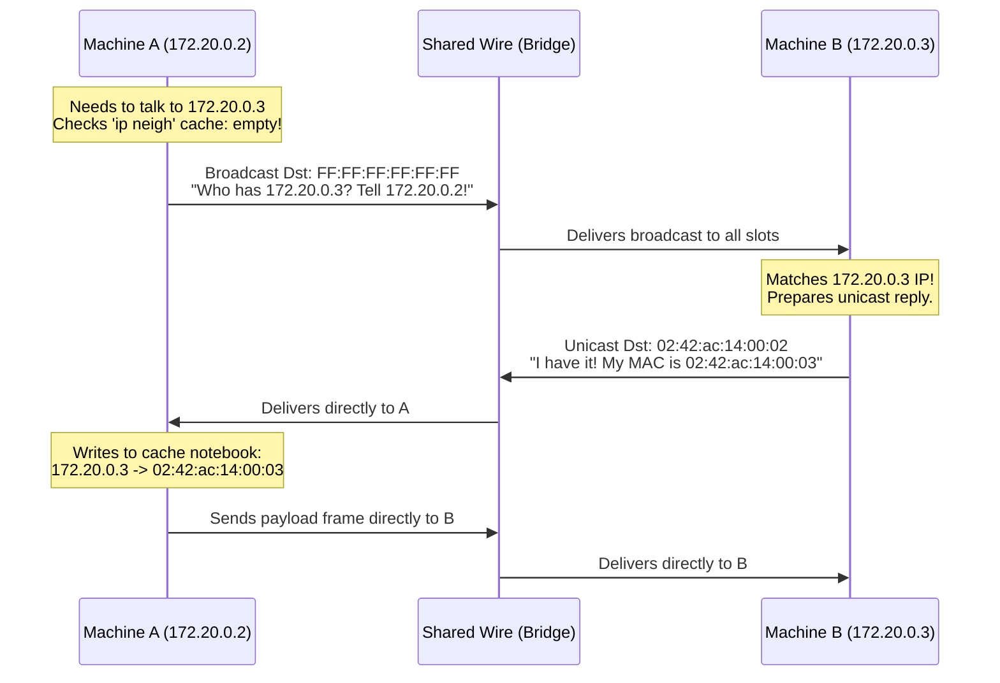

# Diagram: ARP Discovery Flow (Module 04)

This diagram shows how the OS kernel yells a broadcast message to discover the hardware MAC address of a destination IP, then updates its internal cache notebook (`ip neigh`).

# 
