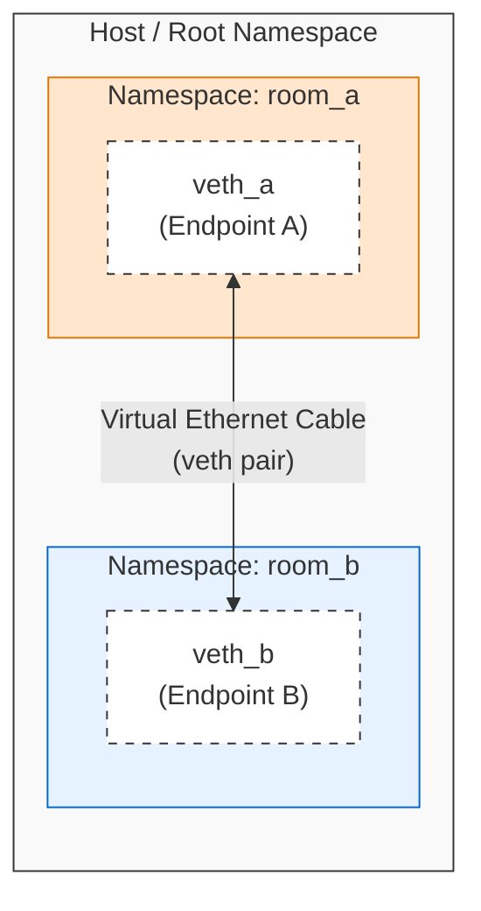

# Diagram: Isolated Namespaces & Veth pairs (Module 05)

This diagram shows how the OS kernel uses network namespaces to isolate network stacks, and a virtual ethernet (`veth`) pair to create a private tunnel between them.

