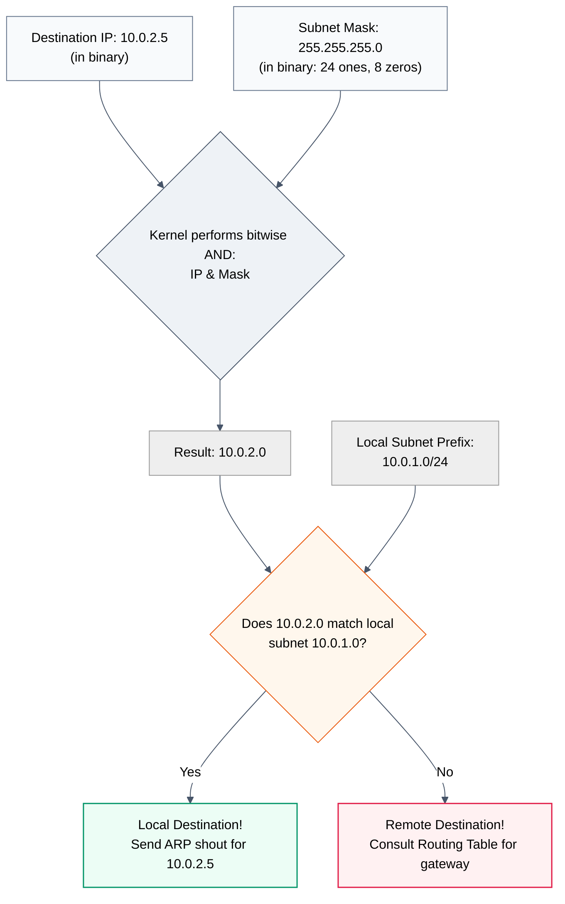

# Act III: Escaping the Building · If I leave the room, how does mail find me?

> **You are here:** Act III · Question 6 of 13
> **Time:** ~20 minutes
> **Tools you'll meet:** `ip addr`, `ipcalc`, `ip route`
> **Prerequisites:** [Module 05: The Walls](../05-the-walls/)

---

> [!NOTE]
> **🗺️ The Seeker's Path: How to Study This Module**
> To master this module's concept, follow these steps in order:
> 1. **Predict:** Read **Your Prediction** and guess what will happen.
> 2. **Setup:** Go to **The Lab** and spin up your privileged container.
> 3. **Run the Lab:** Run the IP configuration and ping commands in **The Investigation** steps.
> 4. **Visualise the Flow:** Study the embedded **Mermaid Diagram** under **Visualise the Flow** to understand how the kernel's bitwise AND operation determines if a packet is local or remote.
> 5. **Break It:** Tighten the subnet mask boundary to `/30` and watch the direct link fail.

---

## The Situation

In the previous module, we built two isolated rooms (`room_a` and `room_b`) using network namespaces and connected them with a virtual Ethernet thread. 

But they sit in absolute silence. 

A thread of connection is useless if you do not know who resides on the other side. We must assign **Room Numbers** (IP Addresses) to each mail slot to identify them.

But an IP address is not just a random label. It is a composite pattern that encodes two things:
1. **The Floor** (Network Subnet) — Where the room sits in the building.
2. **The Room** (Host IP) — The specific slot on that floor.

Let's assign these numbers and watch the kernel try to navigate the space.

---

## Your Prediction

> [!IMPORTANT]
> **Before running any commands, pause and reflect:**
> If we assign Room A the IP `10.0.1.1` with netmask `255.255.255.0` (Floor 1), and Room B the IP `10.0.2.1` with netmask `255.255.255.0` (Floor 2), and try to ping between them over our direct cable, will the ping succeed? Or does the logical distinction of "floors" prevent them from speaking, despite the physical link?

---

## The Lab

Start the privileged environment:

```bash
cd act-3--escaping-the-building/06-the-room-number/lab
docker compose down
docker compose up -d
docker compose exec workbench bash
```

Let's rebuild our two rooms and the virtual cable from the previous module. 

Run these setup commands inside your workbench shell:

```bash
# Build rooms
ip netns add room_a
ip netns add room_b

# Build hallway
ip link add veth_a type veth peer name veth_b

# Thread cable
ip link set veth_a netns room_a
ip link set veth_b netns room_b

# Start links
ip netns exec room_a ip link set dev veth_a up
ip netns exec room_b ip link set dev veth_b up
```

---

## The Investigation

Let's use `ip addr` to assign room numbers.

### Step 1: Assign IPs on Different Subnets (Different Floors)

Let's put the rooms on different floors.
- Assign `room_a` IP `10.0.1.1` on subnet `10.0.1.0/24` (Floor 1).
- Assign `room_b` IP `10.0.2.1` on subnet `10.0.2.0/24` (Floor 2).

**Run this:**
```bash
ip netns exec room_a ip addr add 10.0.1.1/24 dev veth_a
ip netns exec room_b ip addr add 10.0.2.1/24 dev veth_b
```

Verify the address assignment inside `room_a`:
```bash
ip netns exec room_a ip addr show veth_a
```

---

### Step 2: Try to Talk Across Floors

Now, try to ping `room_b` (`10.0.2.1`) from `room_a`:

**Run this:**
```bash
ip netns exec room_a ping -c 1 10.0.2.1
```

**What to look for:**
The command fails instantly with:
```text
ping: connect: Network is unreachable
```

**What it means:**
The kernel did not even attempt to send a packet down the wire! 
It looked at the target IP (`10.0.2.1`), used the subnet mask (`255.255.255.0` or `/24`) as scissors to extract the floor prefix (`10.0.2.0`), compared it to its own floor (`10.0.1.0`), realized they were on different floors, and searched its map (routing table) for how to get to Floor 2. Finding no routing rules, it gave up instantly with "Network is unreachable."

---

### Step 3: Use ipcalc to Decode the Scissors

Let's see how the kernel uses the subnet mask to cut IPs in binary.

**Run this:**
```bash
ipcalc 10.0.1.1/24
```

**What to look for:**
`ipcalc` splits the address:
- `Address`: `10.0.1.1`
- `Netmask`: `255.255.255.0 = 24`
- `Network`: `10.0.1.0/24`
- `HostMin/Max`: `10.0.1.1` to `10.0.1.254`

**What it means:**
The netmask `/24` means the first 24 bits are locked for the network prefix ("Floor 1"). Any IP starting with `10.0.1` is considered local to this floor. The remaining 8 bits are for individual hosts (rooms).

---

### Step 4: Put them on the Same Floor

Let's change Room B's IP so it sits on the same floor as Room A: `10.0.1.2`.

First, remove the old IP from `room_b`:
```bash
ip netns exec room_b ip addr del 10.0.2.1/24 dev veth_b
```

Now, assign the new IP:
```bash
ip netns exec room_b ip addr add 10.0.1.2/24 dev veth_b
```

Try the ping from `room_a` again:
```bash
ip netns exec room_a ping -c 1 10.0.1.2
```

**What to look for:**
It works!
```text
1 packets transmitted, 1 received, 0% packet loss, time 0ms
```

**What it means:**
The target prefix (`10.0.1.0`) matched the sender's prefix. The kernel realized they were on the same floor, sent an ARP shout to find the MAC address for `10.0.1.2`, wrote the MAC on the envelope, and sent it down the veth cable.

> [!TIP]
> **🔍 First-Principles Verification**
> Let's verify that the kernel automatically adds local subnet routing rules whenever you assign an IP address. In your workbench shell, run:
> ```bash
> ip netns exec room_a ip route show dev veth_a
> ```
> **What to look for:**
> You will see a route like:
> `10.0.1.0/24 proto kernel scope link src 10.0.1.1`
> This is a **Link Route**. It proves the kernel automatically registers this subnet prefix as local, allowing it to bypass gateway routing and shout directly over the wire.

---

---

## 🗺️ Visualise the Flow

Now that you've assigned IP addresses and tested pings across subnets, look at the diagram below (also available as a standalone reference in [flow.md](file:///Users/rahullohia/repos/networking_crash_course_for_kubernetes/act-3--escaping-the-building/06-the-room-number/diagrams/flow.md)) to visualize how the kernel uses the subnet mask to determine if a destination is local or remote:



---

## The Evidence

The kernel's routing decisions are governed by the routing table. Let's look at Room A's table:

```bash
ip netns exec room_a ip route
```
You will see:
```text
10.0.1.0/24 dev veth_a proto kernel scope link src 10.0.1.1
```
This is a **Link Route**. The kernel automatically wrote this map rule when you assigned the IP. It says: *"If a packet is for floor 10.0.1.0/24, send it directly out of veth_a. No clerk needed."*

Because we had no route for `10.0.2.0/24` in Step 2, the packet died.

---

## 💡 The Moment

> [!TIP]
> **The Pattern and the Scissors:**
> An IP address is meaningless without its subnet mask. The mask is the binary scissors that tells the kernel where the community (subnet) ends and the individual (host) begins. If your scissors cut at the wrong place, the kernel becomes blind, treating a local neighbor as a distant stranger, refusing to speak even when connected by a direct wire.

---

## Break It
## Break It

What happens if we tighten the scissors, making the subnet boundary too restrictive?

1. Remove Room A's address:
   ```bash
   ip netns exec room_a ip addr del 10.0.1.1/24 dev veth_a
   ```
2. Assign it a `/30` mask (which only allows 2 hosts per network prefix):
   ```bash
   ip netns exec room_a ip addr add 10.0.1.1/30 dev veth_a
   ```
3. Look at `ipcalc 10.0.1.1/30`. The host range is `10.0.1.1` to `10.0.1.2`. Room B is `10.0.1.2`, so they should still talk, right? Let's check:
   ```bash
   ip netns exec room_a ping -c 1 10.0.1.2
   ```
   It works!
4. Now, change Room B's IP to `10.0.1.5` (which would be on the same subnet under a `/24` mask, but falls outside our narrow `/30` boundary):
   ```bash
   ip netns exec room_b ip addr del 10.0.1.2/24 dev veth_b
   ip netns exec room_b ip addr add 10.0.1.5/30 dev veth_b
   ```
5. Ping `10.0.1.5` from `room_a`. It fails with `Network is unreachable`. Even though they share the same physical cable, the strict subnets make them virtual strangers.

---

## What You Can Do Now

- You can assign IP addresses and netmasks using `ip addr`.
- You can use `ipcalc` to analyze subnets and binary ranges.
- You can explain how the kernel makes routing decisions using the subnet AND operation.

---

## The New Problem

We can talk to neighbors on our floor.

But a city cannot exist on a single plane. We must have separate floors—different subnets. When Room A (`10.0.1.1`) needs to send mail to Room B (`10.0.2.1`) across floors, the local shout is trapped by the wall. 

The mail must be handed to a **Mail Clerk** (Router) standing at the stairwell, who will consult a routing map to carry the envelope across. 

How do we build this routing map?

**[Next: Act III, Question 7 → The Map](../07-the-map/)**
