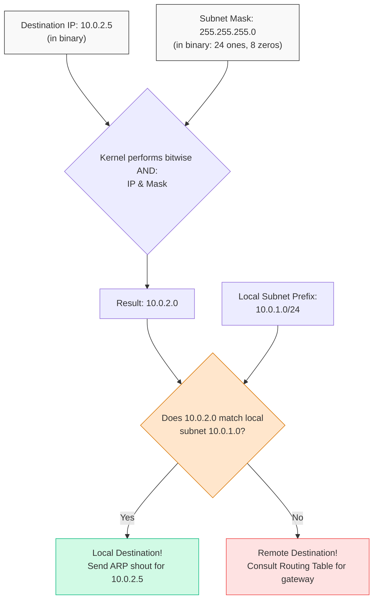

# Diagram: Subnet Mask & Routing Decision (Module 06)

This diagram shows how the OS kernel uses the subnet mask (the "scissors") to decide if a packet is destined for the local network or needs to go to a gateway.

