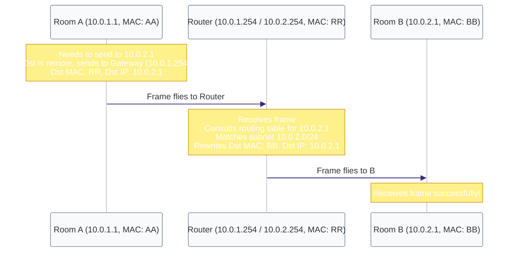

# Diagram: Multi-hop Routing & MAC Rewrites (Module 07)

This diagram shows how a packet travels across floors (subnets). The logical IP addresses stay the same, but the hardware MAC addresses are rewritten at each hop.

