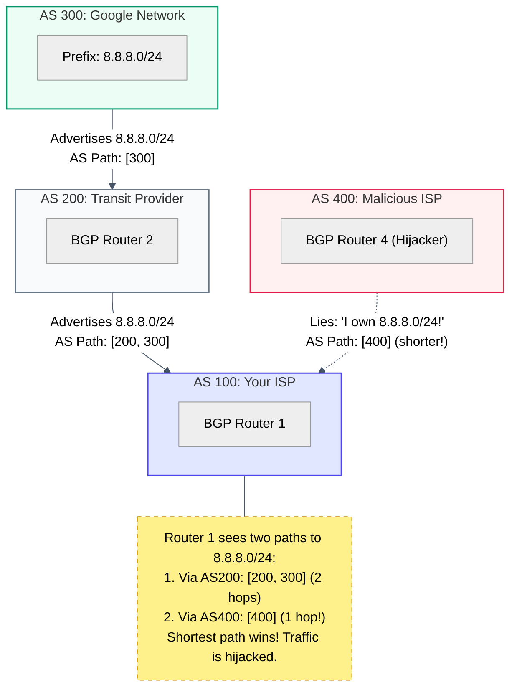

# Act III: Escaping the Building · How do the mail clerks automatically map the world?

> **You are here:** Act III · Question 8 of 13
> **Time:** ~20 minutes
> **Tools you'll meet:** `traceroute -A`, BGP hijacking case study
> **Prerequisites:** [Module 07: The Map](../07-the-map/)

---

> [!NOTE]
> **🗺️ The Seeker's Path: How to Study This Module**
> To master this module's concept, follow these steps in order:
> 1. **Predict:** Read **Your Prediction** and guess what will happen.
> 2. **Setup:** Go to **The Lab** and spin up your container.
> 3. **Run the Lab:** Run the traceroute and whois commands in **The Investigation** steps.
> 4. **Visualise the Flow:** Study the embedded **Mermaid Diagram** under **Visualise the Flow** to understand how BGP prefix advertisements and hijacking work.
> 5. **Break It:** Review the self-healing routing behavior during physical connection failures.

---

## The Situation

In the previous module, we configured static routes. We manually told `room_a` that to reach Floor 2, it must pass the packet to the router at `10.0.1.254`.

This works when you have two or three floors. 

But the global internet connects **billions of devices** divided into **hundreds of thousands of subnets**. No human can manually type routes for all of them. More importantly, physical wires cut, routers crash, and ISPs go bankrupt. The map of the world changes thousands of times every hour.

The mail clerks (routers) need a way to build this map dynamically. They do this by gossiping.

In the global internet, large networks (like Comcast, Google, or your local university) are called **Autonomous Systems (AS)**. They talk to each other using a gossip protocol called **BGP** (Border Gateway Protocol).

Let's see how this BGP gossip shapes the road your packets take.

---

## Your Prediction

> [!IMPORTANT]
> **Before running any commands, pause and reflect:**
> When you type `google.com` in your browser, your packets travel across multiple network providers. If one of those network providers suddenly advertises a fake, shorter route to Google's IP addresses, how will the internet routers react? Will they verify the ownership, or will they blindly follow the shortcut?

---

## The Lab

Start your environment (make sure your host computer is connected to the internet):

```bash
cd act-3--escaping-the-building/08-the-gossip/lab
docker compose down
docker compose up -d
docker compose exec workbench bash
```

---

## The Investigation

Let's trace a packet leaving our container and crossing the borders of different autonomous networks.

### Step 1: Trace a Path Across Autonomous Systems

Inside the workbench container, run `traceroute` with the `-A` flag. This flag tells the tool to look up the Autonomous System (AS) number for every hop in the routing databases:

**Run this:**
```bash
traceroute -A -n 8.8.8.8
```

**What to look for:**
Look at the output lines. You will see columns showing IP addresses and, in brackets, the AS numbers:

```text
1  172.20.0.1  0.050 ms
2  192.168.1.1 [AS???] 1.200 ms
...
5  96.120.88.21 [AS7922]  12.450 ms   (Comcast)
...
10 72.14.238.22 [AS15169] 18.120 ms  (Google)
11 8.8.8.8      [AS15169] 18.050 ms  (Google)
```

**What it means:**
1. Your packet started on your local network.
2. It hopped onto your ISP's network (e.g. Comcast, AS7922).
3. It crossed transit networks until it reached Google's Autonomous System (AS15169).
4. Google's internal routers delivered it to the DNS server at `8.8.8.8`.

Each BGP router along the way learned about Google's IP block because Google's routers broadcasted: *"Hey, we own 8.8.8.0/24. If you send packets here, the path is AS15169."*

---

### Step 2: The BGP Hijack (The YouTube Incident)

To understand how BGP gossip works, we must look at what happens when a router lies.

In 2008, the government of Pakistan ordered the local ISP (Pakistan Telecom) to block YouTube. To do this, their engineers decided to redirect all YouTube traffic inside Pakistan to a black hole.

They configured their BGP routers to advertise to their local neighbors: *"We own YouTube's IP block (208.65.153.0/24)!"*

But their local neighbors gossiped with their global neighbors. Within minutes, Pakistan Telecom's fake advertisement spread across the entire globe.

**Why did global routers follow the lie?**
1. Pakistan Telecom advertised a more specific subnet (`/24`) than YouTube's own advertisement (`/22`). In routing, the **Longest Prefix Match** (the more specific rule) always wins.
2. Global routers saw a route that looked "closer" and more specific, and immediately redirected YouTube traffic from New York, London, and Tokyo to Pakistan Telecom's routers, crashing their network and blocking YouTube globally for 2 hours.

---

---

## 🗺️ Visualise the Flow

Now that you've traced Autonomous Systems and read the case study, look at the diagram below (also available as a standalone reference in [flow.md](file:///Users/rahullohia/repos/networking_crash_course_for_kubernetes/act-3--escaping-the-building/08-the-gossip/diagrams/flow.md)) to visualize how BGP prefix advertisements and routing path hijacking occur in the global mesh:



---

## The Evidence

You can check prefix allocations using `whois` queries. Run this inside the container:

```bash
whois 8.8.8.8
```
Look for the `origin` field. It shows the AS responsible for advertising this IP:
```text
OriginAS:       AS15169
```
When you run `traceroute -A`, the program is querying these exact WHOIS databases to show you the AS numbers.

---

## 💡 The Moment

> [!TIP]
> **The Self-Healing Gossip:**
> The global internet runs entirely on trust. There is no central authority verifying BGP advertisements. If a router in Frankfurt lies, packets from London will blindly follow the lie into the void. The internet is not a rigid grid; it is a fluid, self-healing conversation of self-correcting gossip.

---

## Break It

We cannot hijack Google's traffic from our container (our ISP blocks fake BGP advertisements at our domestic door). But we can witness BGP's self-healing nature.

If you have a persistent ping running to an external address:
```bash
ping 8.8.8.8
```
And your physical network connection goes down, BGP routers across the globe will detect the lost link, recalculate paths via alternative providers (e.g. routing around a cut undersea fiber), and update their tables. When your connection comes back, your traffic resumes, often taking a completely different sequence of AS hops than before.

---

## What You Can Do Now

- You can trace packets across ISP boundaries and identify Autonomous Systems (`traceroute -A`).
- You can explain how BGP gossiping builds the global internet map.
- You can explain BGP hijacking and prefix routing rules.

---

## The New Problem

We now understand how a packet travels across the globe, escaping namespaces, hopping routers, and traversing ISPs until it reaches the target computer.

But when the packet arrives at the target computer, it finds 10 different programs running (a web server, a database, a mail client, etc.). 

How does the target kernel decide which program gets the packet? If they all share the same network card and IP address, who opens the mail?

**[Next: Act IV, Question 9 → The Desk Number](../../act-4--the-conversation/09-the-desk-number/)**
