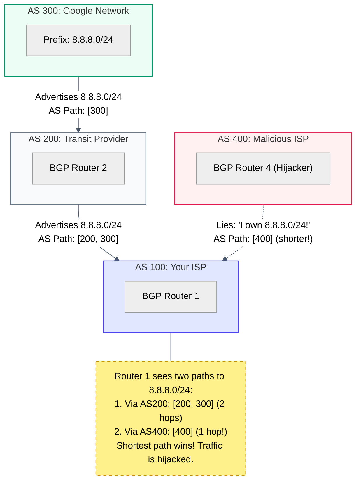

# Diagram: BGP Gossip & AS Paths (Module 08)

This diagram shows how Autonomous Systems (large networks owned by ISPs or tech giants) gossip using BGP to advertise which IP prefixes they can reach, and the shortest AS Path wins.

