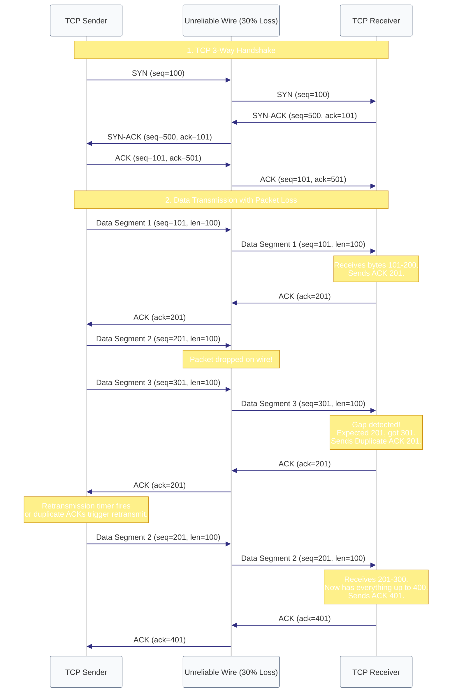

# Act IV: The Conversation · The mailman lost half the pages. How do we fix this?

> **You are here:** Act IV · Question 10 of 13
> **Time:** ~25 minutes
> **Tools you'll meet:** `tc qdisc` (netem packet loss), `tcpdump -S`, `seq_numbers.py` (pcap parser)
> **Prerequisites:** [Module 09: The Desk Number](../09-the-desk-number/)

---

> [!NOTE]
> **🗺️ The Seeker's Path: How to Study This Module**
> To master this module's concept, follow these steps in order:
> 1. **Predict:** Read **Your Prediction** and guess what will happen.
> 2. **Setup:** Go to **The Lab** and spin up your container.
> 3. **Inspect the Code:** Open [seq_numbers.py](file:///Users/rahullohia/repos/networking_crash_course_for_kubernetes/act-4--the-conversation/10-the-registered-mail/code/seq_numbers.py) to see how the python parser processes tcpdump outputs to track sequence numbers.
> 4. **Run the Lab:** Introduce network loss and run the TCP transfer in **The Investigation** steps.
> 5. **Visualise the Flow:** Study the embedded **Mermaid Diagram** under **Visualise the Flow** to trace how SYN, SYN-ACK, and ACK packets retransmit when data is dropped on the wire.
> 6. **Break It:** Switch to UDP and send a stream of numbers, watching the packets vanish without recovery.

---

## The Situation

We can route packets to target desks across the globe. 

But the hallway (the network wire) is drafty. Electrical signals get corrupted, routers overheat, and switches drop packets when they get overloaded. The network is fundamentally **unreliable**.

Imagine sending a 100-page manuscript to a friend. If the mailman loses page 42, the entire document is broken; the thread of meaning is severed. The receiver cannot make sense of a fragmented story.

If we send files or messages over this unreliable wire, how do we guarantee that every single byte arrives intact, and in the correct order, without duplicating or losing data?

We use a protocol called **TCP** (Transmission Control Protocol), which acts like a registered mail service. It numbers every page, waits for confirmation slips, and automatically resends lost pages.

Let's break the wire and see how TCP survives.

---

## Your Prediction

> [!IMPORTANT]
> **Before running any commands, pause and reflect:**
> If we configure the virtual network interface to discard exactly 30% of all incoming packets, and we attempt to transfer a file using TCP, will the file arrive corrupted? Or will it arrive perfectly, but take slightly longer? Can the kernel maintain the illusion of order amidst chaos?

---

## The Lab

Start your environment:

```bash
cd act-4--the-conversation/10-the-registered-mail/lab
docker compose down
docker compose up -d
```

Open three terminal windows:
- **Terminal 1** (`sender`):
  ```bash
  docker exec -it tcp_sender bash
  ```
- **Terminal 2** (`receiver`):
  ```bash
  docker exec -it tcp_receiver bash
  ```
- **Terminal 3** (Second exec on `sender`):
  ```bash
  docker exec -it tcp_sender bash
  ```

---

## The Investigation

Let's break the wire first. We will use a tool called `tc` (Traffic Control) to add network emulation packet loss.

### Step 1: Witness the Capability Error (The Network Admin Badge)

Before we sabotage the wire, let's understand who has the authority to break things.

Exit the `tcp_sender` container and run this one-off container on your host to see:

```bash
docker run --rm nicolaka/netshoot tc qdisc add dev eth0 root netem loss 30%
```

**What to look for:**
It fails with:
```text
RTNETLINK answers: Operation not permitted
```

**What it means:**
Modifying the network queue scheduler requires the `CAP_NET_ADMIN` kernel capability. The container needs the "network administrator badge." In our `docker-compose.yml`, we explicitly granted this capability to the `sender` container:
```yaml
cap_add:
  - NET_ADMIN
```

Make sure you are back inside Terminal 1 (`tcp_sender`) before proceeding.

---

### Step 2: Sabotage the Interface (30% Packet Loss)

In Terminal 1 (`tcp_sender`), introduce 30% packet loss on the network card:

**Run this:**
```bash
tc qdisc add dev eth0 root netem loss 30%
```

Verify it is active:
```bash
tc qdisc show dev eth0
```

**What to look for:**
It should list `netem loss 30%`.

---

### Step 3: Start the Receiver (The Server)

In Terminal 2 (`tcp_receiver`), get the IP address (`ip addr show eth0`, let's assume it is `172.20.0.3`).
Now start a listening socket on port `8080` using `nc`:

**Run this:**
```bash
nc -l -p 8080 > /tmp/received_file.txt
```

This will save any incoming data to a file.

---

### Step 4: Trace the Conversation

In Terminal 3 (on the `sender` container), start `tcpdump` to capture the raw absolute sequence numbers, and pipe the output to our python formatter script:

> [!TIP]
> **🔍 Step 4a: Inspect the Code First**
> Before running the parser script, open and inspect [seq_numbers.py](file:///Users/rahullohia/repos/networking_crash_course_for_kubernetes/act-4--the-conversation/10-the-registered-mail/code/seq_numbers.py).
> Look at how the Python script parses stdin line-by-line, extracts the TCP flags, sequence number range, and acknowledgment number, and formats it to make the TCP flow readable.

**Run this:**
```bash
tcpdump -i eth0 -S -n tcp port 8080 | python3 /lab/code/seq_numbers.py
```

It is now waiting for packets.

---

### Step 5: Send the File

In Terminal 1 (`tcp_sender`), create a 1,000-character test file and send it to the receiver:

**Run this:**
```bash
python3 -c "print('A' * 1000)" > /tmp/test_file.txt
nc 172.20.0.3 8080 < /tmp/test_file.txt
```

As soon as the transfer finishes, check Terminal 3. You will see a structured trace of the conversation:

**What to look for:**
```text
Timestamp       | Flags | Seq Number   | Ack Number   | Length
------------------------------------------------------------
21:20:00.123456 | S     | 2584102914   |              | 0       (SYN)
21:20:00.123480 | S.    | 1892182012   | 2584102915   | 0       (SYN-ACK)
21:20:00.123500 | .     | 2584102915   | 1892182013   | 0       (ACK)
21:20:00.123520 | P.    | 2584102915   | 1892182013   | 1001    (Data)
21:20:00.223500 | .     |              | 2584103916   | 0       (ACK 1001 bytes)
```

Wait, since 30% packet loss is active, you might see duplicate sequence numbers or duplicate ACKs:
```text
21:20:00.150000 | P.    | 2584102915   | 1892182013   | 1001    (Retransmission!)
```

**What it means:**
1. **The Handshake:** First, `S` (SYN), `S.` (SYN-ACK), and `.` (ACK) fired to establish the connection.
2. **The Sequence:** The sender assigned the first byte sequence number `2584102915`.
3. **The Loss & Recovery:** If a data packet or ACK was dropped, the sender's kernel noticed the timer expired (or received duplicate ACKs) and automatically re-sent the identical byte range (`seq 2584102915`, `length 1001`).
4. **The Integrity:** Check the file on the receiver: `wc -c /tmp/received_file.txt`. It should show exactly `1001` bytes. The file arrived perfectly intact despite 30% of the wire's signals being deleted.

---

---

## 🗺️ Visualise the Flow

Now that you've traced absolute sequence numbers and duplicate ACKs in the pcap parser, look at the diagram below (also available as a standalone reference in [flow.md](file:///Users/rahullohia/repos/networking_crash_course_for_kubernetes/act-4--the-conversation/10-the-registered-mail/diagrams/flow.md)) to visualize how the TCP sender detects packet loss and performs retransmissions:



---

## The Evidence

You can inspect the kernel's active TCP connection counters to see the retransmission stats:

```bash
ss -ti
```
Look at the `retrans` and `lost` fields:
```text
cubic wscale:7,7 rto:200 rtt:0.045/0.012 ato:40 mss:1460 rcvspace:14600 ssthresh:10 ssthresh:7 retrans:1/2 lost:1
```
The kernel keeps track of every drop and schedules retransmission timers in real-time.

---

## 💡 The Moment

> [!TIP]
> **The Illusion of Reliability:**
> The applications you write (browsers, databases, APIs) never handle network packet loss. They believe they are writing to a perfect, unbroken stream. The Linux kernel's TCP stack performs a masterclass in illusion: buffering data in RAM, tracking sequence numbers, and performing silent retransmissions in the background. The reliability of the internet is a kernel-level illusion.

---

## Break It

What happens if we switch to a protocol that doesn't offer registered mail? Let's use UDP.

1. Start a UDP receiver in Terminal 2:
   ```bash
   nc -u -l -p 8080 > /tmp/udp_received.txt
   ```
2. Start sending a stream of numbers from Terminal 1:
   ```bash
   for i in {1..100}; do echo "Line $i"; sleep 0.05; done | nc -u 172.20.0.3 8080
   ```
3. Check the received file on the receiver:
   ```bash
   cat /tmp/udp_received.txt
   ```
   You will notice lines are missing (e.g., `Line 5`, `Line 6` are missing, skipping straight to `Line 8`). UDP does not number pages or request confirmations. If a packet drops on the wire, it is gone forever.

---

## What You Can Do Now

- You can simulate packet loss and latency using `tc qdisc`.
- You can trace TCP absolute sequence numbers and handshakes using `tcpdump -S`.
- You can explain how TCP sequence numbers and ACKs repair unreliable networks.

---

## The New Problem

TCP is wonderful for file transfers because it guarantees every single byte arrives.

But TCP has a massive cost: **Latency**. 

If a single packet in the middle of a stream is lost, TCP pauses the entire conversation (head-of-line blocking) and buffers all subsequent packets in RAM until the lost packet is retransmitted. 

If you are playing a fast-paced multiplayer video game or running a live voice call, you don't care about a dropped frame from 2 seconds ago. You just want the latest frame *right now*. 

How do we send data without handshakes, without ACKs, and without latency?

**[Next: Act IV, Question 11 → The Paper Airplane](../11-the-paper-airplane/)**
