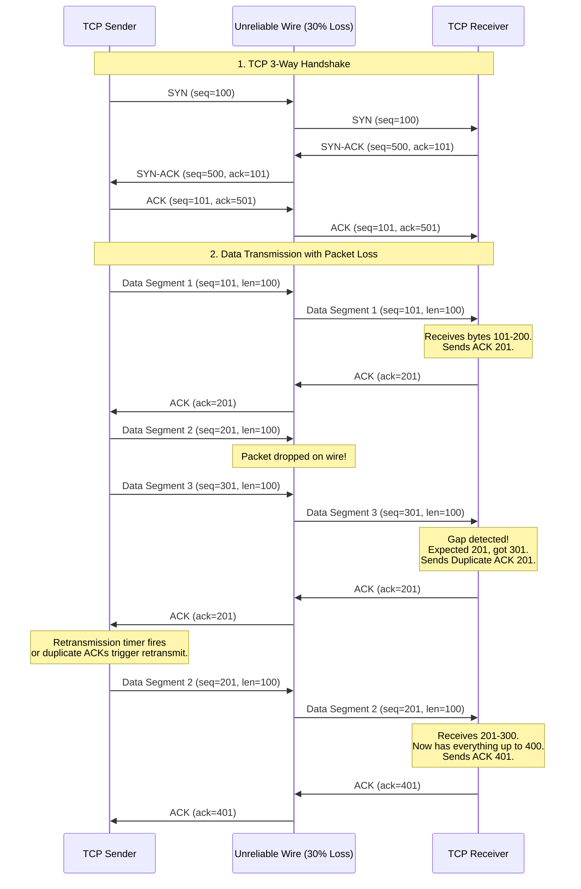

# Diagram: TCP Handshake & Retransmission (Module 10)

This diagram shows how TCP handles packet loss. The sender numbers every byte, and the receiver acknowledges the highest contiguous byte received.

