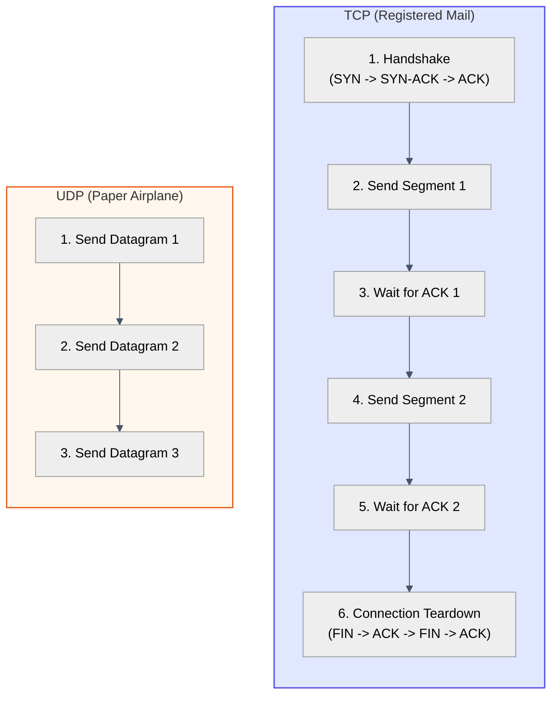

# Act IV: The Conversation · What if we don't care about lost pages, we just want speed?

> **You are here:** Act IV · Question 11 of 13
> **Time:** ~20 minutes
> **Tools you'll meet:** `nc -u`, `tcpdump udp`
> **Prerequisites:** [Module 10: The Registered Mail](../10-the-registered-mail/)

---

> [!NOTE]
> **🗺️ The Seeker's Path: How to Study This Module**
> To master this module's concept, follow these steps in order:
> 1. **Predict:** Read **Your Prediction** and guess what will happen.
> 2. **Setup:** Go to **The Lab** and spin up your container.
> 3. **Run the Lab:** Run the UDP commands in **The Investigation** steps. (No custom code compilation is needed for this module!)
> 4. **Visualise the Flow:** Study the embedded **Mermaid Diagram** under **Visualise the Flow** to compare the overhead of TCP's safe handshake with UDP's direct paper airplane delivery.
> 5. **Break It:** Flood a UDP port and inspect packet receive errors to witness UDP's lack of flow control.

---

## The Situation

In the previous module, we saw how TCP guarantees that every single byte of a file arrives complete and in order, even on a network card configured with 30% packet loss.

But TCP has a massive price tag: **Latency and Overhead**.

Before you send a single byte of data, TCP forces you to exchange 3 handshake packets. While sending data, TCP forces you to pause and wait for confirmation slips (ACKs). If one packet is lost in the middle of a stream, TCP pauses the entire delivery (Head-of-Line blocking) while it retransmits, holding up all subsequent data in memory.

Imagine you are playing a fast-paced multiplayer game. You need to know the enemy player's coordinates *right now*. If the packet containing their position 2 seconds ago gets lost, you don't care. You don't want the game to freeze for 200ms while the kernel retransmits old data. You want the latest packet, and you want it now.

We need a way to send data like throwing a **Paper Airplane** into the room. We throw it, we don't wait for confirmation, and we keep throwing. 

This is **UDP** (User Datagram Protocol).

---

## Your Prediction

> [!IMPORTANT]
> **Before running any commands, pause and reflect:**
> If you start sending data using UDP to a target IP and port, and you suddenly kill the receiver process, will the sender's kernel crash or return an error? Or will it keep blasting data into the void without noticing? Can a sender exist in total isolation from the receiver?

---

## The Lab

Start your environment:

```bash
cd act-4--the-conversation/11-the-paper-airplane/lab
docker compose down
docker compose up -d
```

Open two terminal windows:
- **Terminal 1** (`sender`):
  ```bash
  docker exec -it udp_sender bash
  ```
- **Terminal 2** (`receiver`):
  ```bash
  docker exec -it udp_receiver bash
  ```

---

## The Investigation

Let's test the connectionless nature of UDP.

### Step 1: Start the Ear (tcpdump)

In Terminal 2 (`receiver`), start `tcpdump` to capture UDP packets:

**Run this:**
```bash
tcpdump -i eth0 -n udp
```

It is now listening.

---

### Step 2: Blast Datagrams into the Void

In Terminal 1 (`sender`), try to send UDP data to `172.20.0.3` on port `8080`. 

Notice that we have **not** started any listening program on `172.20.0.3` yet! There is no server running.

**Run this:**
```bash
echo "First Paper Airplane" | nc -u -w 1 172.20.0.3 8080
```

Now check Terminal 2. Did the packet arrive?

**What to look for:**
The `tcpdump` in Terminal 2 shows the packet arriving:
```text
21:30:00.123456 IP 172.20.0.2.12345 > 172.20.0.3.8080: UDP, length 21
```

But check Terminal 1. Did `nc` exit with an error? No! It exited cleanly.

**What it means:**
UDP is connectionless. The sender's kernel did not establish any state machine (no handshake). It simply wrapped the bytes in a UDP header, threw them at the network card, and moved on. It doesn't know or care if anyone is listening.

---

### Step 3: Compare Overhead

Let's look at the packet counts. 

If we send a single string `"Hello"` using TCP, it takes:
1. `SYN` (client -> server)
2. `SYN-ACK` (server -> client)
3. `ACK` (client -> server)
4. `DATA` (client -> server)
5. `ACK` (server -> client)
6. `FIN-ACK` (client -> server)
7. `ACK` (server -> client)
8. `FIN-ACK` (server -> client)
9. `ACK` (client -> server)

That is **9 packets** on the wire just to send 5 characters!

Now run `tcpdump` on the sender container and send the same string over UDP:
```bash
echo "Hello" | nc -u -w 1 172.20.0.3 8080
```
It takes exactly **1 packet**. 

---

## 🗺️ Visualise the Flow

Now that you've sent UDP packets and compared the packet counts on the wire, look at the diagram below (also available as a standalone reference in [flow.md](file:///Users/rahullohia/repos/networking_crash_course_for_kubernetes/act-4--the-conversation/11-the-paper-airplane/diagrams/flow.md)) to visualize the visual contrast between TCP's handshakes/acknowledgments and UDP's direct transmission:



---

## The Evidence

Let's prove UDP doesn't keep connection state. Look at the active sockets inside the sender:

```bash
ss -uln
```
You will see:
```text
State      Recv-Q Send-Q   Local Address:Port   Peer Address:Port
UNCONN     0      0              0.0.0.0:12345        0.0.0.0:*
```
Notice the state says **UNCONN** (Unconnected). Unlike TCP connections which maintain the illusion of a persistent channel (`ESTAB` or `CLOSE_WAIT`), UDP sockets are always unconnected in the kernel table. They are just mailbox slots waiting for inputs or throwing airplanes out.

---

## 💡 The Moment

> [!TIP]
> **The Paper Airplane of the Mind:**
> UDP does not offer reliability, ordering, or connection tracking. By stripping all these guarantees away, it removes all handshakes and transmission delays. UDP is the protocol of choice for anything where speed is critical and a lost frame is better than a delayed frame. It is the art of let-go: throwing data into the wind and not clinging to whether it lands.

---

## Break It

What happens if you flood a UDP port?

1. Start a UDP listener on the receiver in Terminal 2:
   ```bash
   nc -u -l -p 8080 > /dev/null
   ```
2. In Terminal 1, blast data as fast as possible:
   ```bash
   dd if=/dev/zero bs=1024 count=100000 | nc -u -q 0 172.20.0.3 8080
   ```
3. Watch the interface packet drop counts:
   ```bash
   netstat -su
   ```
   Look at `packet receive errors` or `rcvbuf errors`. Because UDP has no flow control (it doesn't slow down when the receiver is struggling), the receiver's socket buffer overflows and the kernel just silently deletes the incoming packets in RAM. UDP doesn't care. It has no mechanism to slow down.

---

## What You Can Do Now

- You can send and receive connectionless UDP datagrams using `nc -u`.
- You can explain the tradeoffs in latency and packet overhead between TCP and UDP.
- You can trace UDP traffic using `tcpdump udp`.

---

## The New Problem

We now have two ways to hold a conversation: safe but slow (TCP) and fast but risky (UDP). We can reach any room number in the building.

But humans are terrible at memorizing room numbers. No one wants to type `142.250.190.46` to check their search engine. They want to type `google.com`. 

The network card and the IP router know nothing about letters or names. They only process binary numbers.

We need a distributed chain of **Phonebooks** to translate human-friendly names into room numbers before we send any mail.

**[Next: Act V, Question 12 → The Phonebook](../../act-5--making-it-human/12-the-phonebook/)**
