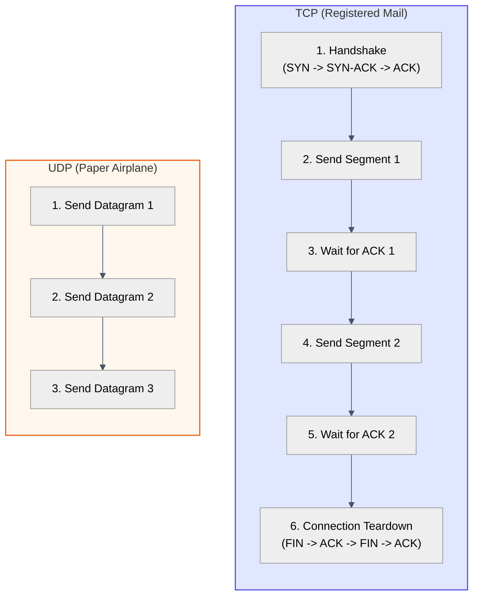

# Diagram: TCP vs. UDP Protocol Overhead (Module 11)

This diagram shows the comparison between the heavy, safe TCP protocol and the lightweight, fast UDP protocol.

```mermaid
%%{init: { 'theme': 'neutral', 'themeVariables': { 'primaryColor': '#F8FAFC', 'primaryBorderColor': '#64748B', 'lineColor': '#475569' }}}%%
flowchart TD
    subgraph TCP ["TCP (Registered Mail)"]
        direction TB
        T1["1. Handshake<br/>(SYN -> SYN-ACK -> ACK)"]
        T2["2. Send Segment 1"]
        T3["3. Wait for ACK 1"]
        T4["4. Send Segment 2"]
        T5["5. Wait for ACK 2"]
        T6["6. Connection Teardown<br/>(FIN -> ACK -> FIN -> ACK)"]
        
        T1 --> T2 --> T3 --> T4 --> T5 --> T6
    end

    subgraph UDP ["UDP (Paper Airplane)"]
        direction TB
        U1["1. Send Datagram 1"]
        U2["2. Send Datagram 2"]
        U3["3. Send Datagram 3"]
        
        U1 --> U2 --> U3
    end

    style TCP fill:#E0E7FF,stroke:#4F46E5,stroke-width:1.5px
    style UDP fill:#FFF7ED,stroke:#EA580C,stroke-width:1.5px
```
