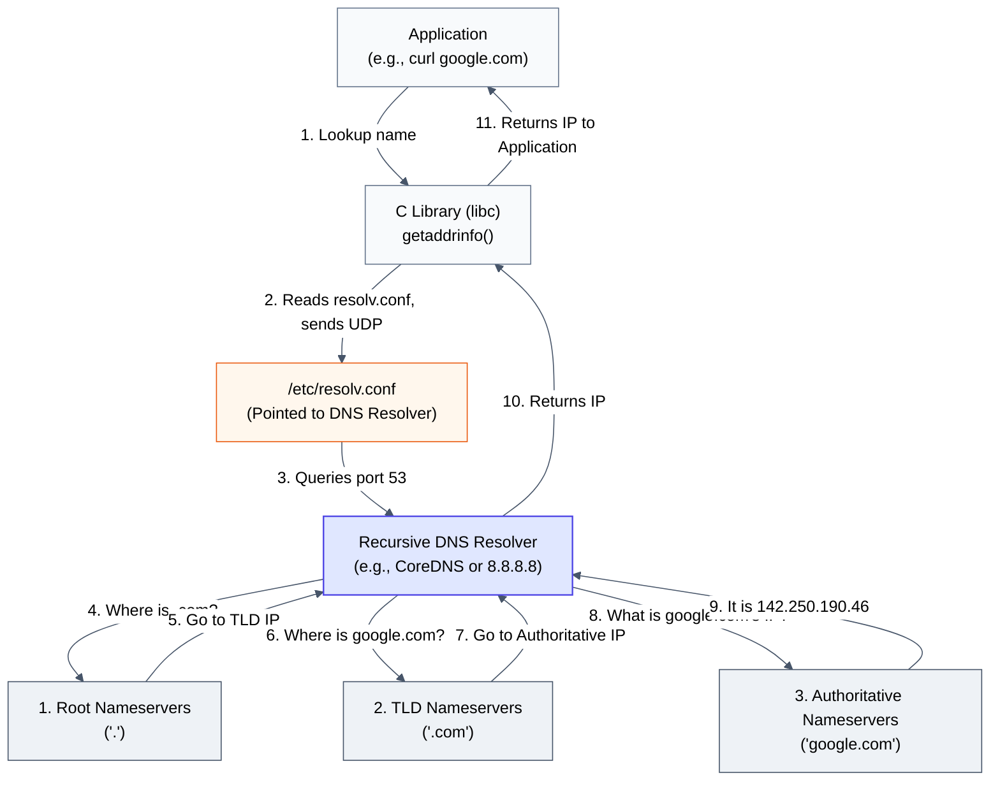

# Act V: Making It Human · How did the first one figure out the number?

> **You are here:** Act V · Question 12 of 13
> **Time:** ~20 minutes
> **Tools you'll meet:** `drill`/`dig`, `/etc/resolv.conf`, `strace`, `tcpdump`
> **Prerequisites:** [Module 11: The Paper Airplane](../../act-4--the-conversation/11-the-paper-airplane/)

---

> [!NOTE]
> **🗺️ The Seeker's Path: How to Study This Module**
> To master this module's concept, follow these steps in order:
> 1. **Predict:** Read **Your Prediction** and guess what will happen.
> 2. **Setup:** Go to **The Lab** and spin up your container.
> 3. **Run the Lab:** Run the resolv.conf inspection, tcpdump port 53 capture, and drill syscall tracing in **The Investigation** steps. (No custom code compilation is needed for this module!)
> 4. **Visualise the Flow:** Study the embedded **Mermaid Diagram** under **Visualise the Flow** to trace how name resolution traverses the resolver hierarchy.
> 5. **Break It:** Empty `/etc/resolv.conf` to blind the resolver and observe how curl by host name fails while curl by IP continues to succeed.

---

## The Situation

We can route packets to target desks across the globe. We have reliable TCP conversations and fast UDP paper airplanes.

But humans do not think in numbers. We do not want to memorize IP addresses like `142.250.190.46` to browse search engines. We want to type human-friendly names like `google.com`.

However, the hardware network card and the kernel IP router know absolutely nothing about names. They only understand binary numbers inside packet headers. They live in a world of pure mathematics.

Before we can send any data over a socket, something must translate the human name into an IP address.

This is **DNS** (Domain Name System), which acts like a distributed chain of phonebooks.

Let's see who is doing the translation.

---

## Your Prediction

> [!IMPORTANT]
> **Before running any commands, pause and reflect:**
> When a program calls `connect()` to a host name, does the Linux kernel perform the DNS lookup? Or is the lookup performed entirely in userspace before the kernel is ever called? Does the core of the OS care about names, or is it purely mathematical?

---

## The Lab

Start your environment:

```bash
cd act-5--making-it-human/12-the-phonebook/lab
docker compose down
docker compose up -d
docker compose exec workbench bash
```

---

## The Investigation

> [!NOTE]
> *Note on Scaffolding:* You've built strong muscles using `tcpdump` and `strace` over the last 11 modules. We will no longer hold your hand. You must construct the commands yourself.

### Step 1: Read the Phonebook Settings

Inspect the local system file that tells your container where to find the nameserver phonebook.

**Action:**
Read `/etc/resolv.conf`.

**What to look for:**
Look for the `nameserver` line. What IP address does it list? E.g., `127.0.0.11` (Docker's internal DNS resolver).

---

### Step 2: Capture the secret phonebook query

Every time you resolve a name, a secret network request fires in the background.

**Action:**
1. Start `tcpdump` on your interface. Configure it to capture **only** UDP packets on port `53` (the DNS port). Let it run.
2. In a second terminal inside the container, execute:
   ```bash
   curl -I http://google.com
   ```
3. Stop the capture and inspect the packets.

**What to look for:**
You should see a UDP query packet containing the string `google.com` flying out to the nameserver IP, followed immediately by a reply packet containing the resolved IP addresses (`142.250.190.46`). Only after this UDP exchange did the TCP SYN packet to port 80 fire.

> [!TIP]
> **🔍 First-Principles Verification**
> Let's bypass the network entirely and verify how the C library resolves names locally before hitting the DNS port. In your container terminal, add a fake entry to your local index card file:
> ```bash
> echo "1.1.1.1 google.com" >> /etc/hosts
> curl -I http://google.com
> ```
> **What to look for:**
> You will see `curl` try to connect to `1.1.1.1` instead of Google's real IP address. 
> 
> If you check your `tcpdump` window, you will notice that **no network packet was sent to port 53**. This proves that name resolution is executed in userspace by the standard C library (`getaddrinfo` wrapper), which checks the local filesystem `/etc/hosts` before calling the socket API. 
> *(Be sure to edit `/etc/hosts` and remove the fake entry when finished!)*

---

### Step 3: Trace the Syscalls

Let's prove where the lookup happens. We will run `drill` (a DNS utility) and trace its system calls.

**Action:**
Trace the system calls of `drill google.com`. Specifically filter the trace to show only `connect`, `sendto`, and `recvfrom` calls.

**What to look for:**
The trace output will show a UDP socket creation followed by:
```text
connect(3, {sa_family=AF_INET, sin_port=htons(53), sin_addr=inet_addr("127.0.0.11")}, 16) = 0
sendto(3, "\242\241\1\0\0\1\0\0\0\0\0\0\bgoogle\3com\0\0\1\0\1", 28, ...) = 28
recvfrom(3, "\242\241\201\200\0\1\0\1\0\0\0\0\bgoogle\3com\0\0\1\0\1\300\f\0\1"..., 512, ...) = 44
```

**What it means:**
The lookup happens entirely in **userspace**! 
The kernel knows nothing about DNS. The application (or the standard C library, `libc`) reads `/etc/resolv.conf`, opens a standard UDP socket to port 53, sends the name string in a packet, and receives the IP block back. 

Only after the application gets the IP address does it call `connect()` to start the actual TCP connection.

---

---

## 🗺️ Visualise the Flow

Now that you've traced the system calls and UDP packets on port 53, look at the diagram below (also available as a standalone reference in [flow.md](file:///Users/rahullohia/repos/networking_crash_course_for_kubernetes/act-5--making-it-human/12-the-phonebook/diagrams/flow.md)) to visualize how name resolution requests travel up the DNS hierarchy:



---

## The Evidence

Let's read `/etc/hosts`. This is your local index card file:

```bash
cat /etc/hosts
```
You will see local overrides:
```text
127.0.0.1   localhost
```
If you write `1.1.1.1 google.com` inside `/etc/hosts`, your browser will try to reach `1.1.1.1` instead of Google. The C library checks this index card file *before* querying the nameserver on the network.

---

## 💡 The Moment

> [!TIP]
> **The Abstraction of Names:**
> The Linux kernel doesn't know what a domain name is. It is completely blind to words. If you tell the kernel to send bytes to "google.com", it returns an error. Your application's userspace libraries do all the heavy lifting, translating names to numbers using UDP port 53 before the kernel ever sees the packets. The kernel only walks in a world of pure mathematics.

---

## Break It

What happens if we blind the C library?

1. Delete the nameserver configuration:
   ```bash
   echo "" > /etc/resolv.conf
   ```
2. Try to fetch Google using its name:
   ```bash
   curl -I http://google.com
   ```
   It fails with: `Could not resolve host: google.com`. The C library is blind.
3. Now, try to fetch Google using its raw IP address:
   ```bash
   curl -I http://142.250.190.46
   ```
   It works! The kernel doesn't care that `/etc/resolv.conf` is empty. The routing map is intact; only the phonebook was destroyed.

---

## What You Can Do Now

- You can explain the split between userspace name resolution (`libc`) and kernel-level IP routing.
- You can trace DNS packets on port 53 and read nameserver configurations.
- You can override name resolution using `/etc/hosts` and `/etc/resolv.conf`.

---

## The New Problem

Everything is working. We can route packets globally using names translated to IPs.

But we have a final problem. There are over 15 billion devices connected to the internet. However, the IP address system we are using (IPv4) only has 4.3 billion possible room numbers. We officially ran out of IP addresses in 2011.

Yet, your container has a private IP address like `172.20.0.2` (which doesn't exist on the public internet), but it can still reach Google.

Who is rewriting the mail envelopes so that billions of private devices can share a few public addresses?

**[Next: Act V, Question 13 → The Con Artist](../13-the-con-artist/)**
