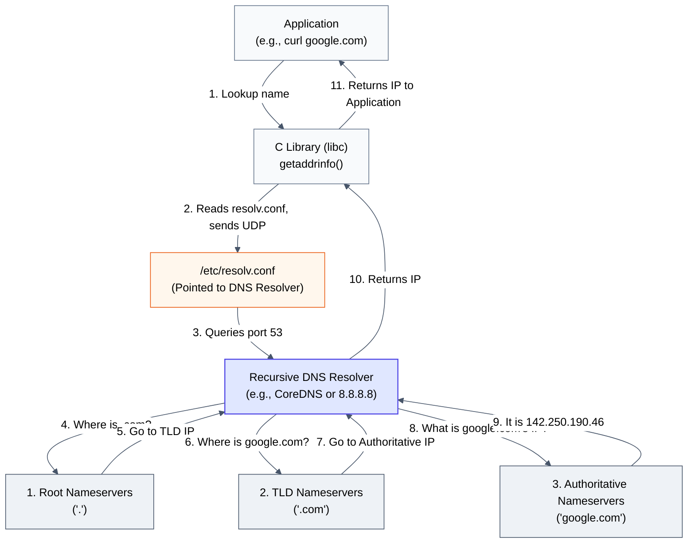

# Diagram: DNS Recursive Resolution (Module 12)

This diagram shows how a name query traverses the chain of phonebooks. The C Library (`libc`) queries the local recursive resolver, which queries the hierarchy if the answer isn't cached.

