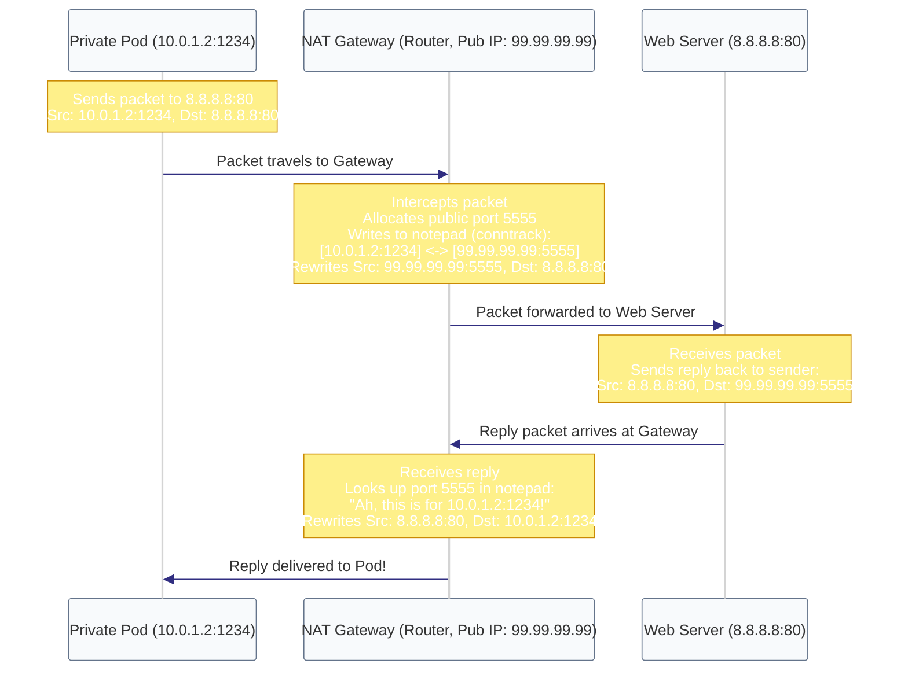

# Act V: Making It Human · We ran out of addresses. How do billions of devices still connect?

> **You are here:** Act V · Question 13 of 13
> **Time:** ~25 minutes
> **Tools you'll meet:** `iptables -t nat`, `/proc/net/nf_conntrack`, `conntrack -F`, `nat_inspect.py`
> **Prerequisites:** [Module 12: The Phonebook](../12-the-phonebook/)

---

> [!NOTE]
> **🗺️ The Seeker's Path: How to Study This Module**
> To master this module's concept, follow these steps in order:
> 1. **Predict:** Read **Your Prediction** and guess what will happen.
> 2. **Setup:** Go to **The Lab** and spin up your privileged container.
> 3. **Inspect the Code:** Open [nat_inspect.py](file:///Users/rahullohia/repos/networking_crash_course_for_kubernetes/act-5--making-it-human/13-the-con-artist/code/nat_inspect.py) to see how the script reads the conntrack memory table.
> 4. **Run the Lab:** Run the network address translation and conntrack commands in **The Investigation** steps.
> 5. **Visualise the Flow:** Study the embedded **Mermaid Diagram** under **Visualise the Flow** to trace how the NAT gateway rewrites source/destination IPs and maps replies back.
> 6. **Break It:** Flush the connection tracking table mid-download and watch the active connection freeze.

---

## The Situation

We can route packets across the globe using names translated to IP addresses. 

But we have a final crisis. The IP addressing scheme we are using (IPv4) only has 4.3 billion possible room numbers. However, there are over 15 billion devices connected to the internet. We officially ran out of IP addresses in 2011.

Yet, you can spin up a new container, and it immediately gets an IP address like `172.20.0.2` (a "private" address that doesn't exist on the public internet). You can `curl google.com`, your packets reach Google, and Google sends the reply back.

How is this possible? If Google doesn't know where `172.20.0.2` is, how did its reply find you?

Someone is rewriting your mail. 

The router at your home (and the Docker daemon on your host) acts as a **Con Artist**. It crosses out your private return address on the envelope, writes its own public IP, and keeps a secret notepad (`conntrack`) to map replies back.

This is **NAT** (Network Address Translation).

---

## Your Prediction

> [!IMPORTANT]
> **Before running any commands, pause and reflect:**
> If you start a persistent TCP connection to a website (e.g. streaming a file), and you suddenly flush the NAT gateway's connection tracking table, what will happen? Will the connection freeze immediately, or will it find a way to recover? Can the conversation survive the sudden loss of memory?

---

## The Lab

Start the privileged NAT workbench:

```bash
cd act-5--making-it-human/13-the-con-artist/lab
docker compose down
docker compose up -d
docker compose exec workbench bash
```

Inside the container, run `ip addr show eth0` and note your private IP. It will look like `172.X.X.X` or `192.168.X.X`.

---

## The Investigation

> [!NOTE]
> *Note on Scaffolding:* This is the final module. You have built deep diagnostic muscles. You will construct the investigation commands yourself.

### Step 1: Read the Con Artist's Notepad

Let's look at how the kernel tracks translations. We have created a helper script `/lab/code/nat_inspect.py` to parse this for us.

> [!TIP]
> **🔍 Step 1a: Inspect the Code First**
> Before executing the script, open and inspect [nat_inspect.py](file:///Users/rahullohia/repos/networking_crash_course_for_kubernetes/act-5--making-it-human/13-the-con-artist/code/nat_inspect.py).
> Notice how the Python script parses `/proc/net/nf_conntrack` directly to read the kernel's connection state, format the hex data, and output a clean table showing how return paths are mapped.

**Action:**
1. In one terminal window, start a persistent connection by downloading a large file in the background (or running a curl loop).
2. In a second terminal, execute `nat_inspect.py` (which reads `/proc/net/nf_conntrack`).

> [!TIP]
> **🔍 First-Principles Verification: Read the Conntrack Table**
> Let's bypass the script wrapper and read the raw kernel connection tracking notepad directly from memory:
> ```bash
> cat /proc/net/nf_conntrack
> ```
> **What to look for:**
> You will see active tracked connections displayed as lines of text:
> ```text
> ipv4     2 tcp      6 431999 ESTABLISHED src=172.20.0.2 dst=142.250.190.46 sport=45230 dport=80 src=142.250.190.46 dst=172.20.0.2 sport=80 dport=45230 [ASSURED] mark=0 zone=0 use=2
> ```
> **How to interpret this table:**
> - `src=172.20.0.2 dst=142.250.190.46 sport=45230 dport=80`: The Original packet headers from the private sender.
> - `src=142.250.190.46 dst=172.20.0.2 sport=80 dport=45230`: The Reply packet headers the kernel expects to receive back.
> 
> The helper script `nat_inspect.py` parses these exact `/proc` entries to present a clean original → reply address translation table. The kernel relies on this state memory to rewrite envelopes automatically.

---

### Step 2: Configure NAT Masquerading

Let's see how we write NAT rules in Linux using `iptables`.

**Action:**
1. Check the NAT rules currently configured inside the workbench:
   ```bash
   iptables -t nat -S
   ```
2. Identify the `MASQUERADE` rule.

**What it means:**
Masquerading is dynamic source NAT. The rule tells the kernel: *"Any packet leaving the container namespace via the external interface should have its source IP replaced with the interface's IP."*

---

---

## 🗺️ Visualise the Flow

Now that you've read the conntrack table and inspected the NAT rules, look at the diagram below (also available as a standalone reference in [flow.md](file:///Users/rahullohia/repos/networking_crash_course_for_kubernetes/act-5--making-it-human/13-the-con-artist/diagrams/flow.md)) to visualize how the NAT gateway intercepts, rewrites, and matches packets back to their source:



---

## The Evidence

The absolute proof is inside `/proc/net/nf_conntrack`. 

Every time a packet is translated, the kernel updates this table. If the conntrack module is unloaded or disabled, NAT breaks completely. The con artist cannot function without his notepad.

---

## 💡 The Moment

> [!TIP]
> **The Grand Con:**
> Your home router, your company's firewall, and Kubernetes services are all running the same con. They rewrite IP packet headers in real-time, crossing out source or destination IPs and changing port numbers to multiplex millions of private addresses onto a handful of public ones. What looks like a global public connection is simply a grand game of cross-outs and replacements, a masterclass in identity swapping.

---

## Break It

What happens if you erase the con artist's notepad during a conversation?

1. Start a persistent download:
   ```bash
   curl -o /dev/null http://ipv4.download.thinkbroadband.com/10MB.zip
   ```
2. While the download is active, flush the connection tracking table:
   ```bash
   conntrack -F
   ```
3. Look at your download terminal. It freezes instantly and eventually timeouts.
4. Why? The return packets from the download server are still reaching your host, but because the notepad was erased, the kernel doesn't know which private container owns port `45230`. It doesn't know who to deliver the letter to, so it throws it in the trash. The connection dies.

---

## You Have Arrived

Congratulations. You have completed the Networking Crash Course. 

Let's trace the journey you took:

1. **Act I (The Socket):** You saw how two programs talk on the same machine using a Named Pipe (`mkfifo`), and how network sockets (`socket()`) are just File Descriptors wearing a costume to let them talk across machines.
2. **Act II (The Hardware):** You saw how computers yell down a shared hallway, and how the network card uses **MAC Addresses** (`ls -e`) and **ARP cache** (`ip neigh`) to filter out local noise.
3. **Act III (The Router):** You saw how namespaces (`ip netns`) build soundproof walls to trap noise, how subnets divide rooms, and how **Routing Tables** (`ip route`) map the road between floors.
4. **Act IV (The Transport):** You saw how ports multiplex traffic to different desks, and how **TCP** sequence numbers paper over packet loss on unreliable wires, while **UDP** throws paper airplanes for raw speed.
5. **Act V (The Illusion):** You saw how **DNS** acts as a phonebook chain, and how **NAT** rewrites envelopes in real-time to share IP addresses.

### Kubernetes is just this, automated.
- A **Pod** is just a Network Namespace (Module 05).
- A **CNI Plugin** (like Calico or Flannel) is just a script that automates namespaces and `veth` pair wiring (Module 05 & 06).
- A **Kubernetes Service** (ClusterIP) is just a NAT rewrite rule configured by kube-proxy using `iptables` (Module 13).
- **CoreDNS** is just a phonebook server running inside a pod (Module 12).

You are no longer afraid of the network. You know how to drop into any container, read the kernel's memory `/proc` tables, trace system calls, and debug the wire.

Go build Kubernetes. You are ready.
