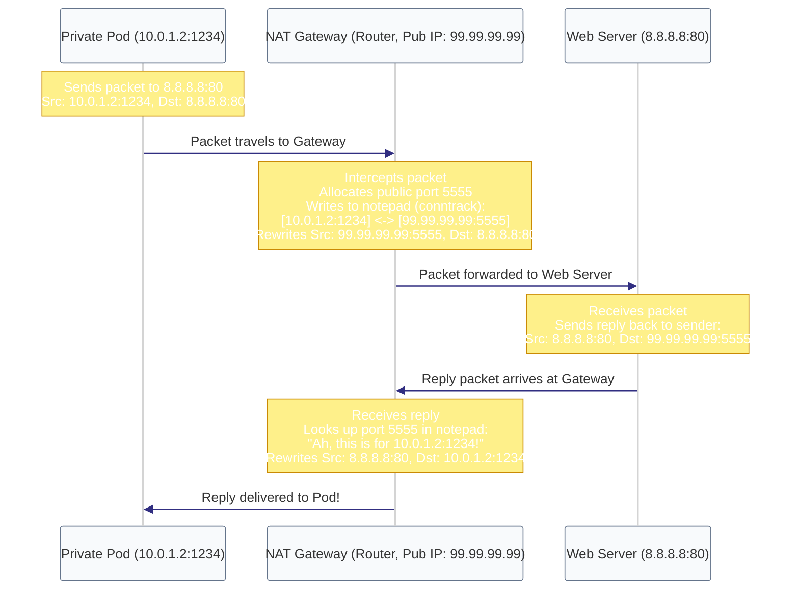

# Diagram: NAT Masquerading & conntrack (Module 13)

This diagram shows how the NAT gateway (the con artist) intercepts outgoing traffic, replaces the private sender IP with its own public IP, and uses a lookup table (`conntrack`) to map replies back.

